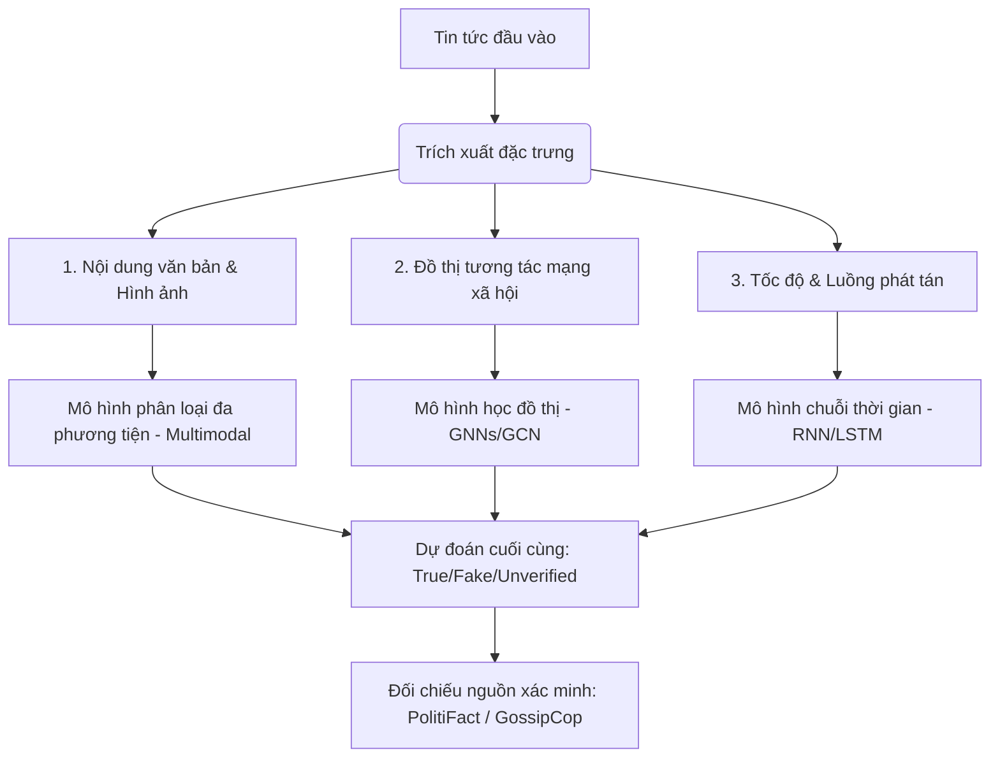

# Phân Tích Công Cụ Xác Thực Tin Tức FakeNewsNet (KaiDMML)

Dưới đây là báo cáo phân tích chi tiết về dự án mã nguồn mở **FakeNewsNet** của nhóm nghiên cứu **KaiDMML** (Đại học Bang Arizona - ASU).  
Link: https://github.com/KaiDMML/FakeNewsNet

---

## 1. FakeNewsNet Là Gì?
**FakeNewsNet** là một kho lưu trữ dữ liệu (Data Repository) và khung thử nghiệm chuẩn (Benchmark Framework) toàn diện được thiết kế để phục vụ nghiên cứu phát hiện tin giả trên mạng xã hội. 

Thay vì chỉ tập trung vào nội dung văn bản thuần túy của tin tức, FakeNewsNet tiếp cận đa chiều bằng cách kết hợp thông tin từ:
*   **Nội dung tin tức (News Content)**
*   **Ngữ cảnh xã hội (Social Context)**
*   **Thông tin không gian - thời gian (Spatiotemporal Information)**

Kho dữ liệu này sử dụng thông tin xác thực từ hai nền tảng kiểm chứng tin tức uy tín: **PolitiFact** và **GossipCop**.

---

## 2. Cách Thức Hoạt Động & Phương Pháp Xác Thực Tin Tức

FakeNewsNet giúp các mô hình học máy (Machine Learning / Deep Learning) thực hiện việc xác thực và phát hiện tin giả thông qua 3 nguồn dữ liệu chính:

### A. Nội dung tin tức (News Content)
*   **Linguistic Features (Đặc trưng ngôn ngữ):** Phân tích từ vựng, ngữ pháp, độ phức tạp của câu, cảm xúc (sentiment) và phong cách viết (writing style) để tìm ra các điểm bất thường thường xuất hiện trong tin giả (như giật gân, thiếu khách quan).
*   **Visual Features (Đặc trưng hình ảnh):** Phân tích hình ảnh đi kèm bài viết để nhận diện các dấu hiệu chỉnh sửa hoặc hình ảnh không khớp ngữ cảnh.

### B. Ngữ cảnh xã hội (Social Context)
Đây là điểm mạnh của FakeNewsNet. Dự án thu thập cách người dùng tương tác với tin tức trên Twitter (X):
*   **User Profiles:** Đặc điểm của người chia sẻ tin (số lượng follower, độ tin cậy của tài khoản, thời gian hoạt động).
*   **Sharing Networks (Mạng lưới chia sẻ):** Xây dựng đồ thị tương tác (ai chia sẻ lại tin của ai - Retweet Network) để phân tích đường đi của tin tức.
*   **User Sentiments / Replies:** Phản ứng, bình luận của cộng đồng đối với tin tức đó (ví dụ: cộng đồng có nghi ngờ, bác bỏ hay đồng tình).

### C. Không gian & Thời gian (Spatiotemporal Information)
*   **Thời gian (Temporal):** Tốc độ lan truyền của tin tức theo thời gian. Tin giả thường có xu hướng bùng nổ rất nhanh trong thời gian ngắn so với tin thật.
*   **Không gian (Spatial):** Vị trí địa lý của các tài khoản chia sẻ tin tức, giúp khoanh vùng nguồn phát tán.

---

## 3. Dự Án Có Sử Dụng Kỹ Thuật RAG (Retrieval-Augmented Generation) Không?

> [!IMPORTANT]
> **Câu trả lời: KHÔNG.** 
> Dự án gốc FakeNewsNet **không** sử dụng kỹ thuật RAG (Retrieval-Augmented Generation).

### Lý do:
1.  **Mục đích cốt lõi:** FakeNewsNet được thiết kế từ năm 2018-2020, trước làn sóng bùng nổ của các mô hình ngôn ngữ lớn (LLMs) và RAG. Mục đích của nó là cung cấp **bộ dữ liệu chuẩn (Dataset)** và các **mô hình phân loại (Classification)** (như SVM, LSTM, GNNs) để gán nhãn tin tức là `True` (Thật) hoặc `Fake` (Giả).
2.  **Cách tiếp cận phân loại:** Hệ thống sử dụng các thuật toán phân loại dựa trên học máy truyền thống và học sâu để đưa ra dự đoán nhãn dựa trên các thuộc tính trích xuất được, chứ không phải quá trình truy xuất (Retrieval) thông tin bên ngoài thời gian thực để tạo câu trả lời (Generation).

### Cơ hội tích hợp RAG:
Mặc dù bản thân FakeNewsNet không có RAG, bạn hoàn toàn có thể sử dụng dữ liệu từ FakeNewsNet làm **Vector Database** (Cơ sở dữ liệu tri thức đã được kiểm chứng) phục vụ cho một hệ thống RAG bên ngoài:
*   **Bước 1 (Retrieval):** Khi người dùng gửi một tin tức cần xác thực, hệ thống RAG sẽ truy xuất các bài viết tương tự trong FakeNewsNet (đã có nhãn True/Fake và dẫn chứng kiểm chứng).
*   **Bước 2 (Generation):** LLM nhận văn bản truy xuất được và viết một bài phân tích/đối chiếu lập luận chính xác cho người dùng.

---

## 4. Mô Hình Kiến Trúc Phát Hiện Tin Giả Đa Chiều

Dưới đây là luồng xử lý dữ liệu và xác thực tin tức thường được áp dụng dựa trên kho dữ liệu FakeNewsNet:

---

## 5. Đề Xuất Ứng Dụng cho HypeRoom AI Copilot

Để phát triển tính năng xác minh tin tức tiếng Việt tuân thủ luật pháp Việt Nam:
1.  **Xây dựng Dataset tương tự cho Việt Nam:** Thu thập dữ liệu từ các nguồn chính thống như Cổng thông tin Chính phủ, các báo lớn (Báo Nhân Dân, Tuổi Trẻ, Thanh Niên) làm tập dữ liệu chuẩn (nhãn Thật) và Trung tâm Tin giả Việt Nam (VAFC) làm tập dữ liệu nhãn Giả.
2.  **Áp dụng RAG thực tế:** Sử dụng cơ sở dữ liệu trên để làm nguồn tri thức (Evidences) cho HypeRoom AI Copilot truy xuất trước khi đưa ra phán quyết về độ tin cậy (`trust_score`).
