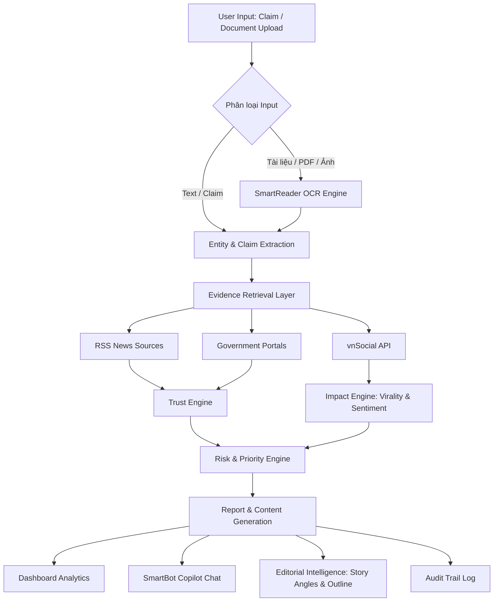

# AI News Intelligence Assistant - System Architecture

## 1. Mục tiêu hệ thống

HypeRoom (AI News Intelligence Assistant) là hệ thống hỗ trợ biên tập viên xác minh tài liệu, đánh giá độ tin cậy và phân tích rủi ro của thông tin/tin đồn dựa trên dữ liệu mạng xã hội và nguồn chính thống.

Hệ thống đánh giá thông tin dựa trên:
- **Trust Score** (Độ tin cậy của thông tin): Xác định qua mức độ xác thực của tài liệu hoặc sự xác nhận của báo chí chính thống/chính phủ.
- **Impact Score** (Mức độ ảnh hưởng): Phản ứng của dư luận xã hội và tốc độ lan truyền (lấy từ vnSocial).
- **Risk Assessment** (Đánh giá rủi ro pháp lý/chính sách): Đưa ra các cảnh báo nhạy cảm trước khi xuất bản.

---

# 2. Kiến trúc tổng thể (Workflow)

---

# 3. Data Sources & APIs Integration

## 3.1 RSS & Government Sources
- **RSS Feeds**: Quét tự động từ các đầu báo chính thống (VnExpress, Tuổi Trẻ, Thanh Niên...) để làm đối chứng.
- **Cổng thông tin Chính phủ**: Quét chính phủ (`chinhphu.vn`) và các bộ ngành (`moet.gov.vn`, `moh.gov.vn`...) để xác định thông tin chính thức có độ ưu tiên cao nhất.

## 3.2 VNPT APIs Integration
1. **SmartReader**: 
   - Trích xuất nội dung văn bản (OCR) từ ảnh chụp công văn hoặc tệp PDF người dùng tải lên.
   - Nhận diện và cấu trúc hóa thông tin để đối chiếu nhanh.
2. **vnSocial**: 
   - Lấy các chỉ số: Mention Count (Lượng thảo luận), Sentiment Score (Sắc thái dư luận), và Trending Velocity (Tốc độ lan truyền) liên quan trực tiếp đến từ khóa/chủ đề được người dùng truy vấn.
3. **SmartVoice**:
   - Chuyển đổi file ghi âm phỏng vấn hoặc ghi âm họp báo thành văn bản văn bản để trích xuất claim.
4. **SmartBot**:
   - Giao diện đàm thoại hỗ trợ biên tập viên đặt câu hỏi, truy vấn nguồn gốc chứng cứ và yêu cầu tùy chỉnh outline bài viết.
5. **SmartUX**:
   - Đo lường hiệu quả thao tác nghiệp vụ trên Dashboard để tối ưu hóa quy trình.

---

# 4. Data Processing Engines

### 4.1 Claim Extraction
Sử dụng Gemini AI để trích xuất các mệnh đề chính cần kiểm chứng từ nội dung text hoặc kết quả OCR của SmartReader.

### 4.2 Trust Engine (Độ tin cậy: 0-100)
- **Authority Score**: Nguồn chứng cứ đối chiếu (Chính phủ > Báo lớn > Mạng xã hội).
- **Cross-source Agreement**: Tỷ lệ thống nhất giữa các nguồn tin cậy.
- **Contradiction Detection**: Phát hiện các luận điểm mâu thuẫn trực tiếp.

### 4.3 Impact Engine (Mức độ tác động: 0-100)
- **Virality Velocity**: Tốc độ và quy mô lan truyền trên mạng xã hội (từ vnSocial).
- **Public Sentiment**: Tỷ lệ tranh cãi, sắc thái tích cực/tiêu cực.
- **Domain Impact**: Phân loại mức độ ảnh hưởng đến các nhóm dân cư, kinh tế hoặc chính trị.

### 4.4 Risk & Editorial Engine
- **Risk Assessment**: Đánh giá khả năng vi phạm pháp luật hoặc gây khủng hoảng truyền thông.
- **Story Generator**: Sinh Story Angles khách quan và đề cương bài viết chi tiết dựa trên chứng cứ đã kiểm chứng.

---

# 5. MVP Scope (Phạm vi triển khai)

- **Input**: Hỗ trợ Nhập Claim bằng Text hoặc Upload Ảnh/PDF công văn (sử dụng SmartReader OCR).
- **Verification**: Đối chiếu dữ liệu với RSS báo chí và Cổng thông tin chính phủ.
- **vnSocial**: Gọi API vnSocial để lấy Sentiment & Mention Count theo keyword được phân tích.
- **Output**: Hiển thị Trust & Impact Score, Báo cáo rủi ro chi tiết, sinh Story Outline an toàn, và tích hợp SmartBot để chat hỏi đáp nhanh về báo cáo.
- **Audit Trail**: Ghi lại lịch sử các bước xác minh và chứng cứ tương ứng.
