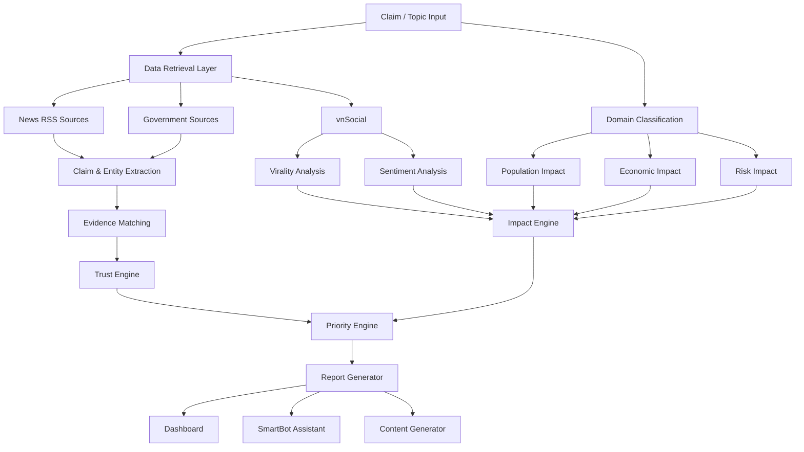

# AI News Intelligence Assistant - System Architecture

## 1. Mục tiêu hệ thống

AI News Intelligence Assistant là hệ thống hỗ trợ đánh giá thông tin dựa trên ba yếu tố:

- Trust Score (Độ tin cậy)
- Impact Score (Mức độ tác động)
- Priority Score (Mức độ ưu tiên theo dõi)

Khác với các hệ thống fact-check truyền thống chỉ xác minh đúng/sai, hệ thống hướng tới việc giúp người dùng và newsroom hiểu:

- Thông tin này đáng tin tới mức nào?
- Thông tin này ảnh hưởng tới ai?
- Thông tin này có đáng để quan tâm hay không?

---

# 2. Kiến trúc tổng thể

# 3. Data Sources

## 3.1 News RSS Sources

Nguồn dữ liệu báo chí được thu thập thông qua RSS Feed.

Ví dụ:

- VnExpress
- Tuổi Trẻ
- Thanh Niên
- Vietnamnet
- Dân Trí
- Lao Động

RSS được dùng để:

- Thu thập bài viết mới
- Tìm nguồn xác nhận claim
- So sánh giữa nhiều nguồn

## 3.2 Government Sources

- chinhphu.vn
- moet.gov.vn
- moh.gov.vn
- sbv.gov.vn
- moit.gov.vn

Vai trò:

- Nguồn bằng chứng ưu tiên
- Tăng Authority Score
- Giảm rủi ro thông tin sai lệch

## 3.3 vnSocial

Thông tin sử dụng:

- Mention Count
- Trending Score
- Sentiment Score

Vai trò:

- Virality Analysis
- Sentiment Analysis
- Social Impact Analysis

# 4. Data Processing Pipeline

1. User nhập claim hoặc chủ đề.
2. Thu thập dữ liệu từ RSS, nguồn chính phủ và vnSocial.
3. LLM thực hiện Claim Extraction và Entity Extraction.
4. Evidence Matching giữa các nguồn.
5. Trust Engine tính Trust Score.
6. Impact Engine tính Impact Score.
7. Priority Engine tính Priority Score.
8. Report Generator tạo báo cáo và nội dung đầu ra.

# 5. Trust Engine

Thành phần:

- Authority Score
- Evidence Count
- Cross-source Agreement
- Contradiction Detection

Output:

- Trust Score (0-100)

# 6. Impact Engine

Thành phần:

- Virality Impact
- Sentiment Impact
- Domain Classification
- Population Impact
- Economic Impact
- Risk Impact

Output:

- Impact Score (0-100)

# 7. Priority Engine

Input:

- Trust Score
- Impact Score

Output:

- Priority Score (0-100)

# 8. AI Models

## Gemini 2.5 Flash

- Claim Extraction
- Entity Extraction
- Domain Classification
- Impact Classification
- Report Generation

## BGE-M3

- Semantic Search
- Claim Matching
- Evidence Retrieval

# 9. VNPT APIs Integration

## vnSocial

- Trend Analysis
- Virality Analysis
- Sentiment Analysis

## SmartReader

- OCR PDF
- OCR công văn
- OCR văn bản hành chính

## SmartVoice

- Speech To Text
- Họp báo
- Phỏng vấn
- Livestream

## SmartBot

- Chat với dữ liệu đã phân tích
- Truy vấn báo cáo

## SmartUX

- Analytics Dashboard
- Theo dõi hành vi người dùng

# 10. MVP Scope (2 tuần)

Bao gồm:

- Nhập claim hoặc chủ đề
- Thu thập dữ liệu từ RSS và nguồn chính thống
- Tính Trust Score
- Tính Impact Score
- Sinh báo cáo giải thích
- Dashboard hiển thị kết quả

Không bao gồm:

- Realtime crawling quy mô lớn
- Knowledge Graph phức tạp
- Fact-check toàn bộ Internet
