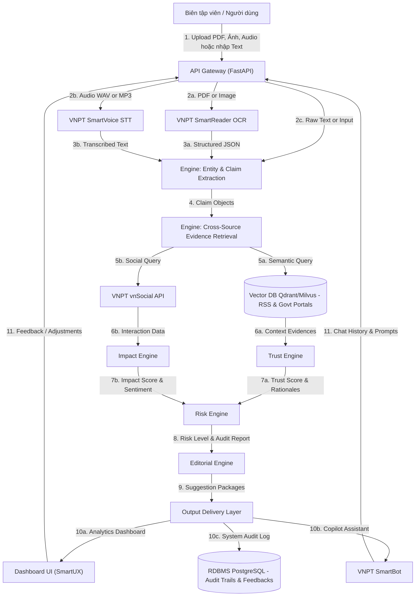

# HypeRoom - System Architecture & Data Flow Design

Tài liệu này mô tả chi tiết kiến trúc hệ thống, luồng tuần tự dữ liệu và cơ chế tích hợp công nghệ cốt lõi của nền tảng **HypeRoom** — hệ thống kiểm chứng thông tin, đánh giá rủi ro xuất bản và hỗ trợ biên soạn nội dung số dựa trên Generative AI và hệ sinh thái VNPT API.

---

## 1. Kiến trúc Tổng quan & Luồng Dữ liệu (Workflow)

Hệ thống hoạt động theo mô hình hướng dịch vụ (Service-Oriented) kết hợp xử lý bất đồng bộ đối với các tác vụ số hóa nặng (OCR, STT). Dưới đây là sơ đồ luồng dữ liệu tích hợp từ khi tiếp nhận dữ liệu đầu vào đến khi chuyển giao sản phẩm báo chí hoàn thiện và tiếp nhận phản hồi từ người dùng (Human-in-the-Loop).

---

## 2. Các thành phần xử lý dữ liệu cốt lõi (Core Engines)

### 2.1 Cổng tiếp nhận & Số hóa đầu vào (Gateway & Input Digitization)
*   **API Gateway (FastAPI)**:
    *   *Mô tả*: Điểm tiếp nhận duy nhất cho tất cả các yêu cầu từ Client. Thực hiện xác thực (JWT), phân luồng tải và quản lý trạng thái tác vụ.
    *   *Giao thức*: REST API (HTTPS) cho các tác vụ đồng bộ ngắn và WebSocket/Webhook cho các tác vụ xử lý file dung lượng lớn.
*   **VNPT SmartReader OCR Integration**:
    *   *Mô tả*: Trích xuất dữ liệu văn bản từ tài liệu quét, ảnh chụp công văn hoặc báo cáo tài chính (PDF, PNG, JPG).
    *   *Giao thức*: Bất đồng bộ (Asynchronous task queue). Hệ thống gửi file lên VNPT SmartReader API, nhận `task_id` và lắng nghe webhook trả về kết quả cấu trúc hóa.
    *   *Dữ liệu*: `Input: Binary File` $\rightarrow$ `Output: Structured JSON` (chứa nội dung văn bản kèm tọa độ thực thể).
*   **VNPT SmartVoice STT Integration**:
    *   *Mô tả*: Chuyển đổi tệp ghi âm phỏng vấn, họp báo hoặc cuộc gọi hotline sang văn bản tiếng Việt.
    *   *Giao thức*: Bất đồng bộ thông qua kiến trúc hàng đợi.
    *   *Dữ liệu*: `Input: Audio File (WAV, MP3)` $\rightarrow$ `Output: Plain Text (String)`.

### 2.2 Động cơ xử lý & Đánh giá nội dung (Processing & Evaluation Engines)
*   **Entity & Claim Extraction (Bộ trích xuất tuyên bố & thực thể)**:
    *   *Mô tả*: Phân tích cú pháp văn bản đã số hóa để tách lọc ra thực thể chính (người, địa điểm, tổ chức) và các tuyên bố mang tính khẳng định cần được kiểm chứng (claims).
    *   *Công nghệ*: **Gemini 2.5 Flash** ứng dụng kỹ thuật *Few-shot Prompting* cấu hình đầu ra dạng cấu trúc định sẵn (JSON Schema).
    *   *Dữ liệu*: `Input: Raw Text` $\rightarrow$ `Output: Array of Claim Objects` (mỗi object gồm: `entity`, `keyword`, `claim_statement`, `category`).
*   **Evidence Retrieval Layer (Tầng truy xuất chứng cứ nguồn chéo)**:
    *   *Mô tả*: Tìm kiếm và thu thập các tài liệu đối chiếu có liên quan cao nhất từ kho lưu trữ báo chí chính thống (RSS) và cổng thông tin chính phủ.
    *   *Công nghệ*: Sử dụng mô hình nhúng đa nhiệm **BGE-M3** để tạo vector đại diện (Embedding) cho cả truy vấn (Dense) và từ khóa (Sparse), thực hiện tìm kiếm hỗn hợp (Hybrid Search) trên Vector Database.
    *   *Dữ liệu*: `Input: Claim String` $\rightarrow$ `Output: List of Top-K Evidence Documents` kèm độ tương đồng (Similarity Score).
*   **Trust Engine (Động cơ đánh giá độ tin cậy)**:
    *   *Mô tả*: Xác định tính chính xác của tuyên bố thông qua việc so khớp với kho chứng cứ.
    *   *Công nghệ*: **Gemini 2.5 Flash** (Zero-shot reasoning) thực hiện đối chiếu ngữ nghĩa nhằm phát hiện mâu thuẫn (Contradiction Detection). Kết quả được tính toán qua công thức Heuristic trọng số nguồn tin:
        $$\text{Trust Score} = w_{\text{source}} \times \text{Semantic Alignment Score}$$
        *(Trong đó: Nguồn Chính phủ $w=1.0$; Báo lớn $w=0.8$; Mạng xã hội/Blog $w=0.3$).*
    *   *Dữ liệu*: `Input: Claim + Evidence List` $\rightarrow$ `Output: Trust Score (0-100)` & Lập luận phân tích (Rationales).
*   **Impact Engine (Động cơ đo lường tác động dư luận)**:
    *   *Mô tả*: Đo lường mức độ quan tâm và sắc thái phản hồi của công chúng đối với các thực thể hoặc từ khóa liên quan trên không gian mạng.
    *   *Công nghệ*: Tích hợp sâu với **VNPT vnSocial API** để truy vấn dữ liệu thời gian thực. Áp dụng thuật toán tính toán tốc độ lan truyền (Mention Velocity Index) kết hợp phân tích cảm xúc (Sentiment Analysis).
    *   *Dữ liệu*: `Input: Keywords` $\rightarrow$ `Output: Impact Score (0-100)` & Chỉ số sắc thái dư luận (Tỷ lệ % Tích cực/Tiêu cực/Trung tính).
*   **Risk Engine (Động cơ phân tích rủi ro xuất bản)**:
    *   *Mô tả*: Đánh giá mức độ nhạy cảm chính trị, rủi ro pháp lý theo Luật Báo chí Việt Nam và nguy cơ xảy ra khủng hoảng truyền thông.
    *   *Công nghệ*: Kết hợp kết quả từ `Trust Score` (độ sai lệch thông tin) và `Impact Score` (mức độ viral) đi qua hệ luật Prompt của **Gemini 2.5 Flash** đối chiếu với cẩm nang chính sách xuất bản đã được định hình trước.
    *   *Dữ liệu*: `Input: Claim + Trust Score + Impact Score` $\rightarrow$ `Output: Risk Level (High / Medium / Low)` & Báo cáo rủi ro chi tiết dưới định dạng Markdown.
*   **Editorial Engine (Động cơ hỗ trợ biên tập)**:
    *   *Mô tả*: Tạo ra các góc tiếp cận báo chí an toàn (Story Angles) và xây dựng dàn ý bài viết (Article Outline) tối ưu từ nguồn thông tin đã xác thực.
    *   *Công nghệ*: **Gemini 2.5 Flash** kết hợp phương pháp RAG (Retrieval-Augmented Generation) để tổng hợp thông tin chuẩn xác, hạn chế tối đa hiện tượng "ảo giác" (hallucination) của mô hình ngôn ngữ lớn.
    *   *Dữ liệu*: `Input: Verified Claims + Risk Report + Target Editorial Direction` $\rightarrow$ `Output: List of Story Angles` & Dàn ý cấu trúc bài viết (Article Outline).

---

## 3. Kiến trúc Lưu trữ Dữ liệu (Database Design)

Để đảm bảo hiệu năng truy vấn thời gian thực và khả năng phân tích báo cáo lịch sử, hệ thống sử dụng kiến trúc Cơ sở dữ liệu hỗn hợp (Polyglot Persistence):

1.  **Cơ sở dữ liệu quan hệ (PostgreSQL)**:
    *   *Vai trò*: Lưu trữ thông tin người dùng, lịch sử phiên làm việc (sessions), nhật ký kiểm định hệ thống (Audit Trails) phục vụ hậu kiểm, và dữ liệu cấu hình của hệ thống.
    *   *Cơ chế Human-in-the-Loop*: Khi biên tập viên phê duyệt hoặc điều chỉnh một Claim/Risk Level trên Dashboard, dữ liệu chỉnh sửa sẽ được ghi đè vào PostgreSQL để hiệu chỉnh độ chính xác của các báo cáo sau này và làm tập dữ liệu Fine-tune prompt.
2.  **Cơ sở dữ liệu Vector (Qdrant / Milvus)**:
    *   *Vai trò*: Lưu trữ các Vector Embedding của kho tri thức phục vụ tra cứu chéo (dữ liệu RSS báo chí chính thống, văn bản pháp luật, thông cáo báo chí của các cơ quan chính phủ).
    *   *Cơ chế cập nhật*: Định kỳ hàng giờ, hệ thống sẽ cào dữ liệu mới từ các nguồn RSS/Cổng thông tin chính phủ, chuyển đổi qua model **BGE-M3** để cập nhật index vào Vector DB.

---

## 4. Bản đồ Tích hợp Hệ sinh thái API VNPT

| Tên dịch vụ | Vai trò trong hệ thống | Phương thức liên kết dữ liệu | Giao thức kỹ thuật |
| :--- | :--- | :--- | :--- |
| **VNPT SmartReader** | Số hóa tài liệu đầu vào | Nhận tệp hình ảnh/PDF $\rightarrow$ Trích xuất văn bản cấu trúc hóa. | REST API (POST `/ocr/segmentation`) |
| **VNPT SmartVoice** | Chuyển đổi dữ liệu âm thanh | Nhận tệp ghi âm $\rightarrow$ Trả ra chuỗi văn bản (STT). | Webhook / REST API (POST `/stt/recognize`) |
| **VNPT vnSocial** | Lắng nghe & Phân tích dư luận | Gửi keyword/chủ đề $\rightarrow$ Trả về khối lượng thảo luận và sắc thái cảm xúc. | REST API (GET `/social/listening/metrics`) |
| **VNPT SmartBot** | Trợ lý ảo Q&A hỗ trợ tác nghiệp | Truy vấn ngữ cảnh báo cáo xác thực và tài liệu nghiệp vụ để giải đáp cho phóng viên. | WebSocket (Duplex communication) |
| **VNPT SmartUX** | Tối ưu hóa giao diện & Trải nghiệm | Thu thập hành vi tương tác trên Dashboard để tự động tối ưu hóa cách bố trí thông tin. | SDK client-side (Event tracking pipeline) |
