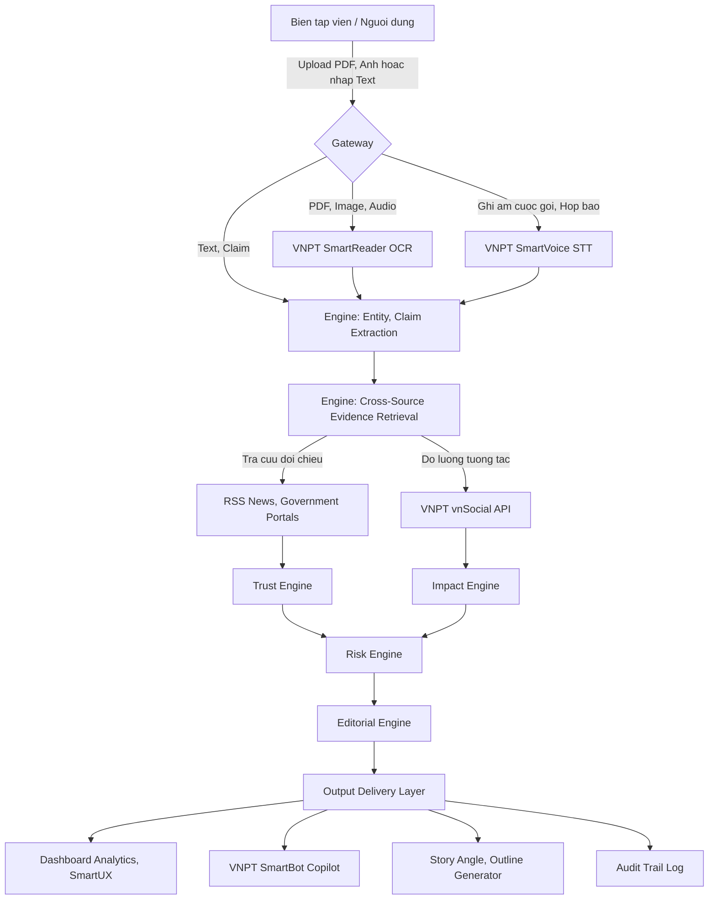

# HypeRoom - System Architecture

## 1. Tổng quan Kiến trúc & Luồng Dữ liệu (Workflow)

HypeRoom là hệ thống tích hợp các API nghiệp vụ của VNPT và Generative AI để hỗ trợ kiểm chứng thông tin, đánh giá rủi ro xuất bản và hỗ trợ biên soạn nội dung số.

---

## 2. Các thành phần xử lý dữ liệu cốt lõi (Core Engines)

### 2.1 Gateway & Input Digitization
*   **VNPT SmartReader**: 
    *   *Mô tả*: Số hóa các tài liệu hình ảnh, PDF (công văn, báo cáo).
    *   *Kỹ thuật & Model*: Sử dụng OCR API của VNPT (hệ thống CNN/Transformer-based độc quyền đã pre-trained). Không cần train lại model.
    *   *Data*: Input là File (PDF, PNG, JPG) $\rightarrow$ Output là Text (Structured JSON).
*   **VNPT SmartVoice**: 
    *   *Mô tả*: Chuyển đổi tệp âm thanh (ghi âm phỏng vấn, họp báo) thành văn bản.
    *   *Kỹ thuật & Model*: Sử dụng Speech-to-Text API của VNPT (Deep Learning ASR Model). Không cần train lại model.
    *   *Data*: Input là Audio (WAV, MP3) $\rightarrow$ Output là Text (String).

### 2.2 Processing & Evaluation Engines
*   **Entity & Claim Extraction**: 
    *   *Mô tả*: Trích xuất thực thể và các tuyên bố cốt lõi cần xác thực.
    *   *Kỹ thuật & Model*: Sử dụng **Gemini 2.5 Flash** qua kỹ thuật Few-shot Prompting & Structured Outputs (JSON Schema). Không train lại.
    *   *Data*: Input là Text từ tài liệu số hóa $\rightarrow$ Output là Claim Object (JSON chứa Entity, Keyword, Claim).
*   **Evidence Retrieval Layer (BGE-M3 & Semantic Search)**:
    *   *Mô tả*: Tìm kiếm chứng cứ có liên quan nhất với Claim.
    *   *Kỹ thuật & Model*: Sử dụng model **BGE-M3** (Dense Retrieval & Sparse Retrieval hybrid) để nhúng vector (Embedding) và thực hiện **Semantic Search** trên Vector Database cục bộ chứa dữ liệu RSS và Government Portals. Không train lại model.
    *   *Data*: Input là Claim String $\rightarrow$ Output là Danh sách Top K Evidence Documents có độ tương đồng cao nhất.
*   **Trust Engine**: 
    *   *Mô tả*: Tính toán chỉ số tin cậy **Trust Score (0-100)**.
    *   *Kỹ thuật & Model*: Sử dụng **Gemini 2.5 Flash** (Zero-shot reasoning) đối chiếu chéo nội dung Claim với Evidence Documents để phát hiện mâu thuẫn (Contradiction Detection) kết hợp công thức heuristic trọng số (Nguồn chính phủ = 1.0, Báo lớn = 0.8, Mạng xã hội = 0.3).
    *   *Data*: Input là Claim + Evidence $\rightarrow$ Output là Trust Score (Float) & Lý do giải thích (String).
*   **Impact Engine (vnSocial Integration)**:
    *   *Mô tả*: Tính toán chỉ số tác động dư luận **Impact Score (0-100)**.
    *   *Kỹ thuật & Model*: Tích hợp **vnSocial API** để lấy thống kê tương tác, kết hợp thuật toán tính trọng số tăng trưởng tuyến tính dựa trên Sentiment & Mention Velocity.
    *   *Data*: Input là Keyword $\rightarrow$ Output là Impact Score (Float) kèm sắc thái dư luận (Negative, Neutral, Positive).
*   **Risk Engine**:
    *   *Mô tả*: Phân tích các rủi ro pháp lý, chính sách, độ nhạy cảm và nguy cơ khủng hoảng truyền thông.
    *   *Kỹ thuật & Model*: Sử dụng **Gemini 2.5 Flash** đối chiếu với tập luật & chính sách xuất bản báo chí Việt Nam để phân tích rủi ro.
    *   *Data*: Input là Claim + Trust Score + Impact Score $\rightarrow$ Output là Risk Level (High, Medium, Low) & Báo cáo rủi ro chi tiết (Markdown).
*   **Editorial Engine**:
    *   *Mô tả*: Tự động sinh các góc tiếp cận thông tin an toàn (Story Angles) và khung bài viết mẫu (Outline).
    *   *Kỹ thuật & Model*: Sử dụng **Gemini 2.5 Flash** kết hợp kỹ thuật RAG (Retrieval-Augmented Generation) để viết bài dựa trên các chứng cứ chuẩn xác đã xác minh.
    *   *Data*: Input là Báo cáo xác thực + Định hướng giảm thiểu rủi ro $\rightarrow$ Output là Story Angles (List) & Article Outline (Markdown).

---

## 3. Bản đồ Tích hợp Hệ sinh thái API VNPT

| Tên dịch vụ | Vai trò trong hệ thống | Phương thức liên kết dữ liệu |
| :--- | :--- | :--- |
| **VNPT SmartReader** | Số hóa tài liệu | Nhận đầu vào ảnh/PDF $\rightarrow$ Trả ra văn bản cấu trúc hóa. |
| **VNPT vnSocial** | Lắng nghe dư luận | Nhận keyword $\rightarrow$ Trả ra Sentiment (sắc thái) & Mention Count. |
| **VNPT SmartVoice** | Chuyển đổi âm thanh | Nhận file Audio $\rightarrow$ Trả ra Text (Speech-to-Text). |
| **VNPT SmartBot** | Trợ lý ảo Q&A | Nhận câu hỏi tự do $\rightarrow$ Truy vấn Context của báo cáo để trả lời biên tập viên. |
| **VNPT SmartUX** | Tối ưu hóa UI/UX | Ghi nhận hành vi tương tác trên Dashboard để cải thiện luồng nghiệp vụ. |
