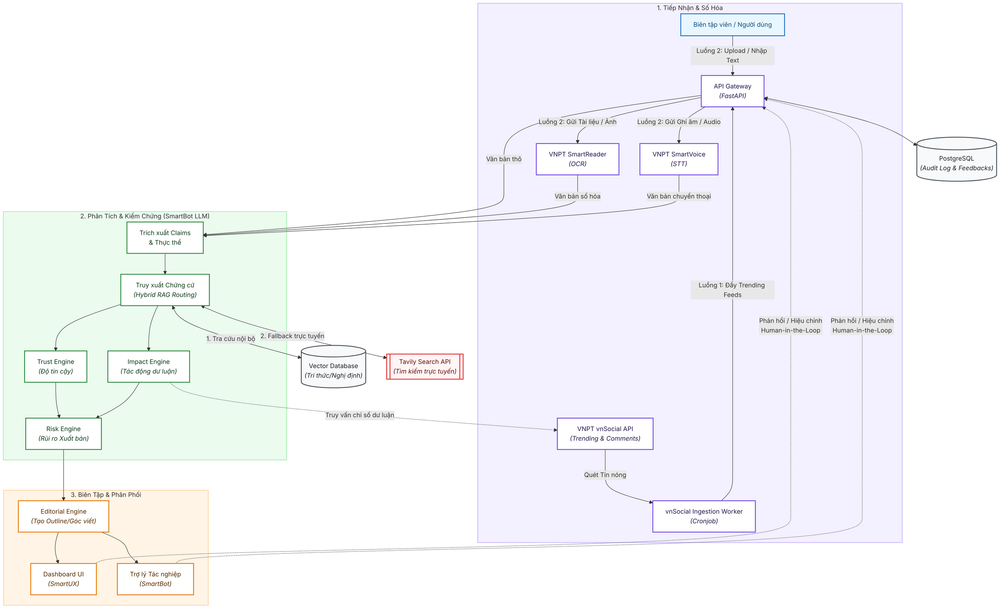

# HypeRoom - System Architecture & Data Flow Design

Tài liệu này mô tả chi tiết kiến trúc hệ thống, luồng tuần tự dữ liệu và cơ chế tích hợp công nghệ cốt lõi của nền tảng **HypeRoom** — hệ thống kiểm chứng thông tin, đánh giá rủi ro xuất bản và hỗ trợ biên soạn nội dung số dựa trên Generative AI và hệ sinh thái VNPT API.

> **Ghi chú diễn giải MVP:** Sơ đồ trong tài liệu này là kiến trúc logic mục tiêu và được giữ nguyên để bảo toàn định hướng hệ thống. Trong MVP, toàn bộ các API VNPT đã liệt kê (`vnSocial`, `SmartReader`, `SmartVoice`, `SmartBot`, `SmartUX`) vẫn nằm trong phạm vi hệ thống; riêng `SmartUX` được tích hợp ở mức tối thiểu để thu thập tín hiệu sử dụng, chưa phải lớp tối ưu hóa UX hoàn chỉnh.
>
> **Cập nhật MVP về RAG:** Ở giai đoạn MVP, team **không triển khai `PostgreSQL + pgvector`** và **không build vector database riêng**. Logic RAG thực tế của MVP là:
> - backend tự search và chọn evidence từ nguồn online chính thống;
> - backend tự lọc, dedupe và chuẩn hóa evidence;
> - backend gửi `claim + selected evidence` sang **VNPT SmartBot** để reasoning và generation;
> - `VectorDB` trong sơ đồ được hiểu là **knowledge retrieval capability** ở mức logic, chưa phải thành phần hạ tầng bắt buộc của MVP.

---

## 1. Kiến trúc Tổng quan & Luồng Dữ liệu (Workflow)

Hệ thống hoạt động theo mô hình hướng dịch vụ (Service-Oriented) kết hợp xử lý bất đồng bộ đối với các tác vụ số hóa nặng (OCR, STT). Dưới đây là sơ đồ luồng dữ liệu tích hợp từ khi tiếp nhận dữ liệu đầu vào đến khi chuyển giao sản phẩm báo chí hoàn thiện và tiếp nhận phản hồi từ người dùng (Human-in-the-Loop).



> **Ghi chú MVP cho sơ đồ trên:** Trong MVP, luồng `Retrieval -> VectorDB` trong sơ đồ được thay bằng **backend online retrieval** qua `Tavily + Trafilatura` và bộ lọc nguồn chính thống. Sơ đồ được giữ nguyên vì đây là kiến trúc logic dài hạn; phần thay đổi chỉ nằm ở implementation của lớp retrieval.

### 1.1 Chi tiết Luồng xử lý Nghiệp vụ (Workflows)

Hệ thống HypeRoom vận hành song song hai luồng dữ liệu chính phục vụ các tình huống tác nghiệp khác nhau của tòa soạn:

#### 🌊 Luồng 1: HOT NEWS / TREND-TO-OUTLINE (Chủ động phát hiện & Kiểm chứng tin nóng)
*   **Mục đích:** Tự động phát hiện và kiểm chứng các tin đồn, bài viết nhạy cảm có nguy cơ lan truyền tin giả trên không gian mạng trước khi bùng phát thành khủng hoảng.
*   **Luồng đi của dữ liệu:**
    1. **Thu thập dữ liệu tự động:** Định kỳ (30-60 phút), hệ thống chạy một Cronjob gọi đến **VNPT vnSocial API** (`GET /social/trending`) để lấy các từ khóa, bài đăng có lượng tương tác đột biến hoặc điểm tranh cãi cao (Controversy Score > 0.7).
    2. **Đẩy vào API Gateway:** Các bài đăng này được đưa vào hàng đợi xử lý của API Gateway dưới dạng văn bản thô.
    3. **Trích xuất thực thể & Claims:** **SmartBot LLM** trích xuất các claims khẳng định từ nội dung bài đăng.
    4. **Kiểm chứng nguồn chéo (Hybrid RAG):** Claims được gửi tới **Evidence Retrieval Layer** để tra cứu văn bản pháp lý nội bộ trong **Vector DB** hoặc tìm kiếm trực tuyến trên các trang báo chính thống thông qua **Tavily Search API**.
    5. **Đánh giá định lượng:** **Trust Engine** tính toán độ tin cậy của tin đồn; **Impact Engine** đo lường quy mô ảnh hưởng; **Risk Engine** đánh giá rủi ro xuất bản theo Luật Báo chí & An ninh mạng Việt Nam.
    6. **Tạo đề cương gợi ý:** **Editorial Engine** sinh Outline định hướng đính chính dư luận.
    7. **Duyệt & Biên tập (Human-in-the-Loop):** Đề cương và kết quả xác minh hiển thị tại trang Giám sát mạng xã hội (VnSocial Dashboard) để Biên tập viên kiểm tra và sử dụng viết bài.

#### 📝 Luồng 2: USER INPUT-TO-OUTLINE (Biên tập viên chủ động xác minh)
*   **Mục đích:** Hỗ trợ Biên tập viên số hóa và kiểm chứng tính chính xác của các tài liệu, công văn hoặc văn bản thô tự nhập.
*   **Luồng đi của dữ liệu:**
    1. **Nhập dữ liệu thủ công:** Biên tập viên tải tệp (PDF, hình ảnh công văn, file ghi âm phỏng vấn) hoặc nhập trực tiếp văn bản thô qua UI Dashboard.
    2. **Số hóa tài liệu:** API Gateway gửi file đến **VNPT SmartReader** để chạy OCR trích xuất văn bản hoặc **VNPT SmartVoice** để chạy STT chuyển file âm thanh thành text.
    3. **Trích xuất Claims & Đối chiếu:** Hệ thống chạy Pipeline tương tự Luồng 1 (Trích xuất Claims $\rightarrow$ Hybrid RAG $\rightarrow$ Trust & Risk Score Evaluation).
    4. **Tạo đề cương tác nghiệp:** Sinh ra các góc biên tập (Story Angles) và Đề cương bài viết an toàn ngay trên giao diện phân tích tài liệu để BTV kết xuất ra bài viết/video.

---

## 2. Các thành phần xử lý dữ liệu cốt lõi (Core Engines)

### 2.1 Cổng tiếp nhận & Số hóa đầu vào (Ingestion Layer)
*   **API Gateway (FastAPI)**:
    *   *Mô tả*: Điểm tiếp nhận duy nhất cho tất cả các yêu cầu từ Client. Thực hiện xác thực (JWT), phân luồng tải và quản lý trạng thái tác vụ.
    *   *Giao thức*: REST API (HTTPS) cho các tác vụ đồng bộ ngắn và WebSocket/Webhook cho các tác vụ xử lý file dung lượng lớn.
*   **VNPT vnSocial Ingestion Service (Cronjob/Worker)**:
    *   *Mô tả*: Tự động thu thập các chủ đề nóng (Trending Topics) và bình luận từ không gian mạng định kỳ để làm nguồn dữ liệu đầu vào tự động.
    *   *Giao thức*: REST API (HTTPS - GET) quét các chỉ số xu hướng. Các bài viết/chủ đề đạt điểm tranh cãi cao (Controversy Score > 0.7) sẽ được tự động đẩy vào hàng đợi của API Gateway để chuyển qua bước trích xuất Claims.
    *   *Dữ liệu*: `Input: Trending Feeds & Comments` $\rightarrow$ `Output: Raw Text / Social Posts`.
*   **VNPT SmartReader OCR Integration**:
    *   *Mô tả*: Trích xuất dữ liệu văn bản từ tài liệu quét, ảnh chụp công văn hoặc báo cáo tài chính (PDF, PNG, JPG).
    *   *Giao thức*: Bất đồng bộ (Asynchronous task queue). Hệ thống gửi file lên VNPT SmartReader API, nhận `task_id` và lắng nghe webhook trả về kết quả cấu trúc hóa.
    *   *Dữ liệu*: `Input: Binary File` $\rightarrow$ `Output: Structured JSON` (chứa nội dung văn bản kèm tọa độ thực thể).
*   **VNPT SmartVoice STT Integration**:
    *   *Mô tả*: Chuyển đổi tệp ghi âm phỏng vấn, họp báo hoặc cuộc gọi hotline sang văn bản tiếng Việt.
    *   *Giao thức*: Bất đồng bộ thông qua kiến trúc hàng đợi.
    *   *Dữ liệu*: `Input: Audio File (WAV, MP3)` $\rightarrow$ `Output: Plain Text (String)`.

### 2.2 Động cơ Phân tích & Kiểm chứng cốt lõi (Processing & Verification Core)
*   **Entity & Claim Extraction (Bộ trích xuất tuyên bố & thực thể)**:
    *   *Mô tả*: Phân tích cú pháp văn bản đã số hóa để tách lọc ra thực thể chính (người, địa điểm, tổ chức) và các tuyên bố mang tính khẳng định cần được kiểm chứng (claims).
    *   *Công nghệ*: **VNPT Smartbot nâng cao** (Hỏi đáp dùng LLM) ứng dụng kỹ thuật *Few-shot Prompting* cấu hình đầu ra dạng cấu trúc định sẵn (JSON Schema).
    *   *Dữ liệu*: `Input: Raw Text` $\rightarrow$ `Output: Array of Claim Objects` (mỗi object gồm: `entity`, `keyword`, `claim_statement`, `category`).
*   **Evidence Retrieval Layer (Tầng truy xuất chứng cứ nguồn chéo)**:
    *   *Mô tả*: Hoạt động theo cơ chế **Hybrid RAG Routing** phân cấp nhằm tối ưu hóa hiệu năng, độ trễ và chi phí:
        1. **Ưu tiên 1 (Local Search):** Truy vấn trước tiên trong Vector DB nội bộ để tìm các văn bản pháp luật hoặc tin đính chính chính thống có sẵn.
        2. **Ưu tiên 2 (Tavily Fallback):** Chỉ khi Vector DB nội bộ không tìm thấy kết quả phù hợp (độ tương đồng dưới ngưỡng 0.75), hệ thống mới kích hoạt gọi API của Tavily để tìm kiếm trực tuyến trên Internet.
        
        ```mermaid
        %%{init: {"flowchart": {"htmlLabels": true, "useMaxWidth": false}, "themeVariables": {"fontSize": "12px", "fontFamily": "Inter"}} }%%
        flowchart TD
            %% Style definitions
            classDef startEnd fill:#e8f7ff,stroke:#1971c2,stroke-width:2px,color:#0f4c81;
            classDef process fill:#ffffff,stroke:#495057,stroke-width:2px,color:#212529;
            classDef decision fill:#fff9db,stroke:#f59f00,stroke-width:2px,color:#5c3e00;
            classDef hit fill:#ebfbee,stroke:#2b8a3e,stroke-width:2px,color:#14401f;
            classDef miss fill:#fff5f5,stroke:#e03131,stroke-width:2px,color:#660e0e;

            Query["Từ khóa / Claim<br>cần xác minh"]:::startEnd
            LocalSearch["1. Truy vấn<br>Vector DB Nội bộ"]:::process
            CheckThreshold{"2. Trùng khớp dữ liệu?<br><i>Cosine Similarity >= 0.75</i>"}:::decision
            
            FastTrack["3a. Lấy trực tiếp kết quả<br>từ DB nội bộ<br><i>(Fast-track Hit)</i>"]:::hit
            WebSearch["3b. Gọi API Tavily Search<br>trực tuyến<br><i>(Search Fallback Miss)</i>"]:::miss
            
            Scraper["4. Cào bài viết gốc<br>bằng Trafilatura"]:::process
            FormatContext["5. Định dạng Context<br>gửi SmartBot LLM"]:::process
            Return["6. Trả về<br>Evidences Context"]:::startEnd

            %% Flow connections
            Query --> LocalSearch
            LocalSearch --> CheckThreshold
            
            CheckThreshold -->|Có - Hit| FastTrack
            CheckThreshold -->|Không - Miss| WebSearch
            
            WebSearch --> Scraper
            Scraper --> FormatContext
            
            FastTrack --> Return
            FormatContext --> Return
        ```
    *   *Công nghệ*: 
        *   **Local DB (MVP implementation: PostgreSQL + pgvector)**: Trong MVP, lớp `VectorDB` ở sơ đồ được hiện thực bằng **PostgreSQL + pgvector** với embedding **keepitreal/vietnamese-sbert** 768 chiều để lưu trữ và so khớp văn bản pháp luật, thông tin chính thống. `ChromaDB/Qdrant` là phương án mở rộng hoặc thay thế sau MVP khi cần scale riêng lớp vector retrieval.
        *   **Online Search (Tavily API)**: Tìm kiếm trực tuyến đa nguồn trên các domain tin cậy khi gặp tin tức mới (Cold Start).
            *   *Cơ chế lọc tên miền ưu tiên:* Sử dụng bộ lọc `include_domains` để chỉ định các tên miền báo chí chính thống Việt Nam (như `chinhphu.vn`, `nhandan.vn`, `tuoitre.vn`, `vtv.vn`, `vnexpress.net`,...). Việc lọc này loại bỏ hoàn toàn các trang mạng xã hội không chính thống và blog rác để bảo đảm tính pháp lý của nguồn tin chứng cứ.
        *   **Scraper Engine (Trafilatura)**: Bóc tách text sạch từ liên kết do Tavily cung cấp.
    *   *Dữ liệu*: `Input: Claim String` $\rightarrow$ `Output: List of Top-K Evidence Documents` kèm nội dung bài báo chi tiết đã được làm sạch và nguồn gốc liên kết.
    *   *Ghi chú MVP*: Trong MVP hiện tại, lớp này được triển khai theo hướng **evidence-first retrieval**:
        *   backend tạo query từ claim;
        *   search online qua **Tavily** trên danh sách domain whitelist;
        *   bóc text bằng **Trafilatura**;
        *   lọc, dedupe, rank và chọn evidence ở backend;
        *   sau đó mới gửi evidence sang **VNPT SmartBot** để reasoning.
        *   `Local Search` và `pgvector` là hướng nâng cấp sau MVP, chưa phải phần bắt buộc phải làm ngay.
*   **Trust Engine (Động cơ đánh giá độ tin cậy)**:
    *   *Mô tả*: Xác định tính chính xác của tuyên bố thông qua việc đối chiếu ngữ nghĩa giữa tuyên bố đầu vào và ngữ cảnh chứng cứ đã trích xuất được.
    *   *Công nghệ*: **VNPT Smartbot nâng cao** (Zero-shot reasoning) thực hiện đối chiếu nhằm phát hiện mâu thuẫn hoặc sự tương đồng. Trực quan hóa phán quyết qua ba mức phân loại chính:
        *   🟢 **Đúng**: Trùng khớp với báo cáo chính thống hoặc tin đính chính.
        *   🔴 **Sai / Tin giả**: Mâu thuẫn trực tiếp với dẫn chứng hoặc trùng khớp với tin giả đã dán nhãn.
        *   🟡 **Chưa xác minh**: Thiếu dẫn chứng chính thống đối chiếu hoặc thông tin trái chiều chưa có kết luận.
    *   *Công thức tính Heuristic*:
        $$\text{Trust Score} = w_{\text{source}} \times \text{Semantic Alignment Score}$$
        *(Trong đó: Nguồn Chính phủ/Cổng TTĐT $w=1.0$; Báo lớn chính thống $w=0.8$; Mạng xã hội/Blog tự do $w=0.3$).*
    *   *Dữ liệu*: `Input: Claim + Evidence List` $\rightarrow$ `Output: Trust Score (0-100)` & Lập luận phân tích (Rationales).
*   **Impact Engine (Động cơ đo lường tác động dư luận)**:
    *   *Mô tả*: Đo lường mức độ quan tâm và sắc thái phản hồi của công chúng đối với các thực thể hoặc từ khóa liên quan trên không gian mạng.
    *   *Công nghệ*: Tích hợp sâu với **VNPT vnSocial API** để truy vấn dữ liệu thời gian thực. Áp dụng thuật toán tính toán tốc độ lan truyền (Mention Velocity Index) kết hợp phân tích cảm xúc (Sentiment Analysis).
    *   *Dữ liệu*: `Input: Keywords` $\rightarrow$ `Output: Impact Score (0-100)` & Chỉ số sắc thái dư luận (Tỷ lệ % Tích cực/Tiêu cực/Trung tính).
*   **Risk Engine (Động cơ phân tích rủi ro xuất bản)**:
    *   *Mô tả*: Đánh giá mức độ nhạy cảm chính trị, rủi ro pháp lý theo Luật Báo chí Việt Nam và nguy cơ xảy ra khủng hoảng truyền thông.
    *   *Công nghệ*: Kết hợp kết quả từ `Trust Score` (độ sai lệch thông tin) và `Impact Score` (mức độ viral) đi qua hệ luật Prompt của **VNPT Smartbot nâng cao** đối chiếu với cẩm nang chính sách xuất bản đã được định hình trước.
    *   *Dữ liệu*: `Input: Claim + Trust Score + Impact Score` $\rightarrow$ `Output: Risk Level (High / Medium / Low)` & Báo cáo rủi ro chi tiết dưới định dạng Markdown.
### 2.3 Biên tập & Phân phối đầu ra (Delivery & Interaction Layer)
*   **Editorial Engine (Động cơ hỗ trợ biên tập)**:
    *   *Mô tả*: Tạo ra các góc tiếp cận báo chí an toàn (Story Angles) và xây dựng dàn ý bài viết (Article Outline) tối ưu từ nguồn thông tin đã xác thực.
    *   *Công nghệ*: **VNPT Smartbot nâng cao** kết hợp phương pháp RAG (Retrieval-Augmented Generation) để tổng hợp thông tin chuẩn xác, hạn chế tối đa hiện tượng "ảo giác" (hallucination).
    *   *Dữ liệu*: `Input: Verified Claims + Risk Report + Target Editorial Direction` $\rightarrow$ `Output: List of Story Angles` & Dàn ý cấu trúc bài viết (Article Outline).
*   **Dashboard UI (Giao diện SmartUX)**:
    *   *Mô tả*: Không gian làm việc số của Biên tập viên để giám sát mạng xã hội thời gian thực, xem kết quả kiểm định tin đồn (Trust/Risk Score) và duyệt/chỉnh sửa các dàn ý bài viết.
    *   *Công nghệ*: Tích hợp SDK **VNPT SmartUX**. Trong MVP, SmartUX được dùng ở mức tối thiểu để ghi nhận tín hiệu tương tác và giữ đúng phạm vi tích hợp VNPT; các cơ chế tối ưu hóa trải nghiệm nâng cao sẽ được hoàn thiện dần sau MVP.
    *   *Dữ liệu*: `Input: API Reports` $\rightarrow$ `Output: Interactive UI / Export PDF Reports / User Feedbacks`.
*   **Trợ lý Tác nghiệp (SmartBot)**:
    *   *Mô tả*: Trợ lý ảo hỏi đáp (Q&A) hỗ trợ phóng viên tương tác trực tiếp bằng ngôn ngữ tự nhiên để truy vấn ngữ cảnh kiểm chứng, điều chỉnh và hoàn thiện đề cương.
    *   *Giao thức*: WebSockets cho phép trao đổi phản hồi hai chiều thời gian thực (duplex communication) dựa trên **VNPT Smartbot** (LLM nâng cao).
    *   *Dữ liệu*: `Input: User Prompt & Search Context` $\rightarrow$ `Output: Natural Language Answers & Custom Outlines`.

---

## 3. Kiến trúc Lưu trữ Dữ liệu (Database Design)

Để đảm bảo hiệu năng truy vấn thời gian thực và khả năng phân tích báo cáo lịch sử, hệ thống sử dụng kiến trúc Cơ sở dữ liệu hỗn hợp (Polyglot Persistence):

1.  **Cơ sở dữ liệu quan hệ và Vector hỗn hợp (PostgreSQL + pgvector)**:
    *   *Vai trò*: Lưu trữ thông tin người dùng, lịch sử phiên làm việc (sessions), nhật ký kiểm định hệ thống (Audit Trails) phục vụ hậu kiểm, và dữ liệu cấu hình của hệ thống. Đồng thời lưu trữ các Vector Embedding của kho tri thức phục vụ tra cứu chéo (dữ liệu RSS báo chí chính thống, văn bản pháp luật, thông cáo báo chí của các cơ quan chính phủ).
    *   *Cơ chế Human-in-the-Loop*: Khi biên tập viên phê duyệt hoặc điều chỉnh một Claim/Risk Level trên Dashboard, hệ thống cập nhật **effective state** hiện hành trong PostgreSQL để UI đọc nhanh, đồng thời lưu đầy đủ lịch sử trước/sau chỉnh sửa vào bảng audit (`feedback_events`) để phục vụ hậu kiểm, replay và tinh chỉnh prompt. Kết quả AI gốc không bị mất dấu.
    *   *Cơ chế cập nhật Vector*: Định kỳ hàng giờ, hệ thống sẽ cào dữ liệu mới từ các nguồn RSS/Cổng thông tin chính phủ, chuyển đổi qua model **vietnamese-sbert** để cập nhật index vector bằng extension `pgvector` ngay trong DB.
    *   *Ghi chú MVP*: Ở bản MVP dùng để demo vòng 2, hệ thống **chỉ triển khai phần PostgreSQL quan hệ** để lưu `claims`, `evidences`, `risk reports`, `feedback events` và trạng thái job. Phần vector storage, embedding và cập nhật index định kỳ được **hoãn sau MVP** để giảm khối lượng triển khai và ưu tiên độ ổn định demo.
2.  **Hàng đợi thông điệp (Redis Queue)**:
    *   *Vai trò*: Upstash Redis đóng vai trò là message broker cho hàng đợi bất đồng bộ (Celery/RQ) giúp điều phối và xử lý các tác vụ tải nặng (OCR từ SmartReader, STT từ SmartVoice).

---

## 4. Bản đồ Tích hợp Hệ sinh thái API VNPT

| Tên dịch vụ | Vai trò trong hệ thống | Phương thức liên kết dữ liệu | Giao thức kỹ thuật |
| :--- | :--- | :--- | :--- |
| **VNPT SmartReader** | Số hóa tài liệu đầu vào | Nhận tệp hình ảnh/PDF $\rightarrow$ Trích xuất văn bản cấu trúc hóa. | REST API (POST `/ocr/segmentation`) |
| **VNPT SmartVoice** | Chuyển đổi dữ liệu âm thanh | Nhận tệp ghi âm $\rightarrow$ Trả ra chuỗi văn bản (STT). | Webhook / REST API (POST `/stt/recognize`) |
| **VNPT vnSocial** | Lắng nghe, phân tích dư luận & Thu thập xu hướng | 1. Tự động cào dữ liệu xu hướng làm đầu vào hệ thống.<br>2. Nhận keyword $\rightarrow$ Trả về khối lượng thảo luận và sắc thái cảm xúc để phân tích tầm ảnh hưởng. | REST API (GET `/social/listening/metrics` & `/social/trending`) |
| **VNPT SmartBot** | Trợ lý ảo Q&A hỗ trợ tác nghiệp | Truy vấn ngữ cảnh báo cáo xác thực và tài liệu nghiệp vụ để giải đáp cho phóng viên. | WebSocket (Duplex communication) |
| **VNPT SmartUX** | Tối ưu hóa giao diện & Trải nghiệm | Thu thập hành vi tương tác trên Dashboard để tự động tối ưu hóa cách bố trí thông tin. | SDK client-side (Event tracking pipeline) |
