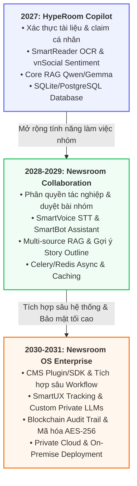

# LỘ TRÌNH PHÁT TRIỂN SẢN PHẨM & KIẾN TRÚC KỸ THUẬT
## Dự án HypeRoom AI Copilot - Giai đoạn 2027 - 2031

Tài liệu này chi tiết hóa cách thức sản phẩm HypeRoom tiến hóa qua từng giai đoạn về mặt tính năng sản phẩm, tích hợp API, kiến trúc AI Pipeline, và hạ tầng bảo mật.

---

## 1. Sơ đồ tiến trình phát triển sản phẩm

---

## 2. Bảng ma trận tiến hóa Sản phẩm & Khách hàng

| Tiêu chí | **2027** | **2028 - 2029** | **2030 - 2031** |
| :--- | :--- | :--- | :--- |
| **Đối tượng phù hợp** | Biên tập viên, Phóng viên, Người sáng tạo nội dung cá nhân | Tòa soạn vừa & nhỏ, Tạp chí chuyên ngành, Nhóm làm việc | Tòa soạn lớn, Đài truyền hình, Cơ quan Chính phủ |
| **Định vị sản phẩm** | **AI Copilot hỗ trợ cá nhân** | **Nền tảng cộng tác tin tức** | **Hệ điều hành tin tức thông minh** |
| **Tính năng cốt lõi** | • Số hóa tài liệu hành chính qua OCR. • RAG Pipeline tự động đối chiếu chéo nguồn tin chính thống. • Tự động sinh báo cáo kiểm tin & đề cương bài viết cá nhân. | • Phân quyền tác nghiệp gồm Tổng biên tập, Biên tập viên, Phóng viên. • Chuyển voice-to-text và tóm tắt file ghi âm phỏng vấn, họp báo. • Chatbot hỗ trợ gợi ý Story Angles và tinh chỉnh outline. | • Plugins/SDK tích hợp trực tiếp vào CMS tòa soạn. • Private Cloud / On-Premise & Mô hình AI tinh chỉnh riêng tư. • Blockchain Audit Trail ghi vết lịch sử kiểm định bài viết. |
| **Giá trị mang lại** | Giúp cá nhân xử lý và xác minh tài liệu nhanh chóng từ 30 phút xuống còn 3 phút, tác nghiệp độc lập chuyên nghiệp. | Tự động hóa quy trình tác nghiệp của tòa soạn, nâng cao 85% tốc độ sản xuất bài viết và kiểm soát rủi ro thông tin nhóm. | Đảm bảo an toàn thông tin tối đa, tự động hóa quy trình nghiệp vụ báo chí quy mô lớn và xác thực uy tín pháp lý bài viết bằng mã kiểm định. |

---

## 3. Chi tiết Lộ trình Phát triển qua từng năm

### Năm 2027: Hoàn thiện Nền tảng & Phiên bản Cá nhân
> [!NOTE]
> **Mục tiêu sản phẩm:** Cung cấp cho từng phóng viên và biên tập viên độc lập một trợ lý AI mạnh mẽ để tự động hóa khâu đọc hiểu, đối chiếu tài liệu và trích xuất claims từ tin đồn trên mạng xã hội.

*   **Tính năng sản phẩm:**
    *   *Input Gateway:* Người dùng chủ động upload ảnh/PDF công văn hoặc gõ trực tiếp các tuyên bố Claims cần xác minh.
    *   *Verification & Risk Report:* Hệ thống phân tích, xếp hạng mức độ tin cậy và xuất file báo cáo rủi ro tự động với các trạng thái Supported / Contradicted / Uncertain.
    *   *Story Outline:* Tự động tạo bản đề cương bài viết sơ bộ cho phóng viên dựa trên thông tin đã xác minh.
*   **Tích hợp VNPT API:**
    *   **SmartReader OCR:** Tự động số hóa, trích xuất text từ văn bản hành chính, ảnh chụp tài liệu của người dùng tải lên.
    *   **vnSocial Sentiment & Trend:** Quét dữ liệu mạng xã hội để xác định mức độ quan tâm Virality Score và sắc thái tranh luận dư luận về chủ đề đó.
*   **Kiến trúc AI & RAG Pipeline:**
    *   Sử dụng LLM Qwen3.5/Gemma-4 để trích xuất thực thể và Claim.
    *   *Core RAG:* Nhúng vector bằng model BGE-m3, lưu trữ tại Vector DB nội bộ Qdrant và tái xếp hạng chứng cứ Rerank bằng model Qwen-Rerank trước khi đẩy vào prompt của SmartBot API để kiểm chứng.
*   **Hạ tầng & Bảo mật:**
    *   Đóng gói hệ thống qua Docker Container, chạy FastAPI backend và Next.js dashboard đơn giản.
    *   Bảo mật HTTPS TLS 1.3 cơ bản.
    *   Sử dụng cơ sở dữ liệu quan hệ PostgreSQL để lưu vết lịch sử tác nghiệp Audit Trail thô.

---

### Năm 2028 - 2029: Nền tảng Cộng tác Nhóm & Tự động hóa tác nghiệp
> [!IMPORTANT]
> **Mục tiêu sản phẩm:** Biến HypeRoom từ một công cụ cá nhân thành một không gian làm việc cộng tác của các nhóm biên tập Team Workspace, hỗ trợ quy trình phân vai và phê duyệt tin bài của tòa soạn báo vừa và nhỏ.

*   **Tính năng sản phẩm:**
    *   *Newsroom Workflow:* Phân quyền tác nghiệp rõ ràng giữa Trưởng ban Editor-in-Chief - người duyệt xuất bản, Biên tập viên Editor - người chỉnh sửa bài viết và Phóng viên Reporter - người phát hiện tin đồn.
    *   *Evidences Knowledge Base:* Cho phép tòa soạn xây dựng kho lưu trữ thông tin chính thống nội bộ để làm căn cứ đối chiếu độc quyền của riêng đơn vị.
    *   *Editorial Brief Generation:* Tự động đề xuất các góc viết Story Angles an toàn, tránh khủng hoảng và lập Editorial Brief đầy đủ định dạng như báo điện tử, script video ngắn TikTok, bài post Facebook.
*   **Tích hợp VNPT API:**
    *   **SmartVoice STT:** Hỗ trợ phóng viên tải lên file ghi âm cuộc gọi phỏng vấn hoặc video họp báo, hệ thống tự động chuyển đổi thành văn bản hành chính để đưa thẳng vào RAG đối chiếu.
    *   **SmartBot Assistant:** Trợ lý ảo AI đàm thoại trực tiếp Chatbot tích hợp ngay trên Dashboard, hỗ trợ giải thích các điểm số tin cậy Trust/Impact Score và hiệu chỉnh nhanh nội dung Outline.
*   **Kiến trúc AI & RAG Pipeline:**
    *   *Multi-Source RAG:* Mở rộng đường ống dữ liệu, hệ thống tự động tìm kiếm kết hợp giữa Google/Bing Search, RSS Feeds báo chí chính thống và kho dữ liệu nội bộ của tòa soạn.
    *   *Controversy Score:* Kết hợp vnSocial API với thuật toán định lượng để tự động tính toán điểm số tranh cãi Controversy Score > 0.7 nhằm đưa ra cảnh báo sớm cho biên tập viên.
*   **Hạ tầng & Bảo mật:**
    *   **Xử lý bất đồng bộ:** Áp dụng Celery kết hợp Redis Message Broker để xử lý các tác vụ kiểm chứng nặng như OCR tài liệu lớn hoặc STT file âm thanh dài.
    *   **Caching & Optimization:** Sử dụng Redis Cache để lưu trữ các trang web đã quét trong vòng 24h, tối ưu băng thông và giảm chi phí cuộc gọi API.
    *   Áp dụng phân quyền chi tiết RBAC - Role-Based Access Control cho tòa soạn báo.

---

### Năm 2030 - 2031: Hệ sinh thái Enterprise & Bảo mật tối cao
> [!CAUTION]
> **Mục tiêu sản phẩm:** Tích hợp trực tiếp HypeRoom vào quy trình vận hành CMS của các cơ quan báo chí, đài truyền hình lớn và bộ ban ngành chính phủ, đảm bảo tính pháp lý và toàn vẹn dữ liệu ở cấp độ cao nhất.

*   **Tính năng sản phẩm:**
    *   *CMS Plugin & SDK:* Phát hành SDK và Plugins mở cho WordPress, Drupal, Custom CMS để tích hợp HypeRoom trực tiếp vào khung soạn thảo bài viết. Phóng viên có thể kiểm chứng claims và số hóa công văn hành chính mà không cần mở tab mới.
    *   *Automatic Verification Badge:* Tự động đính kèm Mã xác thực hoặc Huy hiệu Kiểm chứng lên bài viết sau khi được xuất bản thành công.
*   **Tích hợp VNPT API:**
    *   **SmartUX:** Theo dõi hành vi và tần suất thao tác của biên tập viên trên Dashboard, tự động gợi ý phím tắt và cá nhân hóa bố cục UI/UX nhằm nâng cao 40% hiệu suất làm việc.
*   **Kiến trúc AI & RAG Pipeline:**
    *   *Custom Private LLMs:* Hỗ trợ triển khai và chạy local các mô hình ngôn ngữ lớn LLM được fine-tune chuyên biệt cho tiếng Việt báo chí và các văn bản hành chính Việt Nam.
    *   *On-Premise Deployment:* Cho phép cài đặt toàn bộ hệ thống trên Private Cloud hoặc hệ thống máy chủ vật lý riêng của các đài truyền hình quốc gia để đảm bảo an toàn tuyệt mật thông tin.
*   **Hạ tầng & Bảo mật:**
    *   **Blockchain Audit Trail:** Thay thế cơ sở dữ liệu quan hệ truyền thống bằng việc chuyển toàn bộ dữ liệu lịch sử xác minh, nguồn gốc chứng cứ và dấu vết phê duyệt của Tổng biên tập lên mạng Blockchain phi tập trung Decentralized Ledger. Đảm bảo bản ghi không thể chỉnh sửa, làm bằng chứng pháp lý vững chắc cho tòa soạn khi có tranh chấp thông tin.
    *   Mã hóa toàn diện End-to-End Encryption dữ liệu lưu trữ cấp độ Enterprise bằng thuật toán AES-256.
