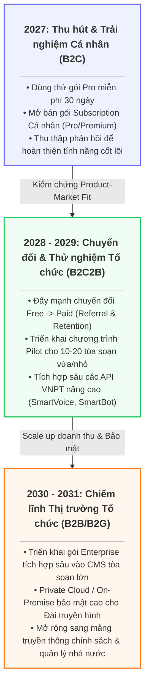

# LỘ TRÌNH PHÁT TRIỂN SẢN PHẨM & GO-TO-MARKET (GTM)
## Dự án HypeRoom AI Copilot (Giai đoạn 2027 - 2031)

Tài liệu này xác định tầm nhìn và lộ trình phát triển của HypeRoom từ một công cụ hỗ trợ cá nhân (B2C) trở thành một hệ điều hành quản trị tin tức và xác thực thông tin toàn diện cho các cơ quan báo chí, tòa soạn và doanh nghiệp (B2B/B2G).

---

## 1. Sơ đồ lộ trình tổng quan

---

## 2. Chi tiết các giai đoạn phát triển

### Giai đoạn 1 (2027): Thu hút & Trải nghiệm Cá nhân (B2C)
> [!NOTE]
> **Trọng tâm:** Xây dựng tệp người dùng cốt lõi (phóng viên, biên tập viên, người làm nội dung số) và kiểm chứng tính năng sản phẩm ở quy mô cá nhân.

*   **Kế hoạch Sản phẩm:**
    *   Cung cấp chương trình trải nghiệm miễn phí **30 ngày** gói Pro đầy đủ tính năng.
    *   Mở bán các gói trả phí cá nhân với mức giá ưu đãi tối ưu hóa thâm nhập thị trường:
        *   *Gói Pro:* 99.000 VNĐ/tháng.
        *   *Gói Premium:* 329.000 VNĐ/tháng.
    *   Tối ưu hóa các chức năng: Kiểm chứng nhanh tài liệu dạng ảnh/PDF (SmartReader OCR), tra cứu xu hướng mạng xã hội (vnSocial Sentiment), và tạo nhanh Đề cương bài viết (Gemini AI).
*   **Mục tiêu GTM & KPIs:**
    *   **MVP ready 100%** & **Analytics setup 100%**
    *   **Waitlist:** 500+
    *   **Beta users:** 1.000+
    *   **CAC < 40.000 VNĐ**

---

### Giai đoạn 2 (2028 - 2029): Chuyển đổi & Mở rộng sang Tổ chức (B2C2B)
> [!IMPORTANT]
> **Trọng tâm:** Chuyển đổi người dùng cá nhân hiện tại thành khách hàng trả phí, đồng thời làm bàn đạp để tiếp cận và bán gói tổ chức (bottom-up adoption).

*   **Kế hoạch Sản phẩm:**
    *   **Referral & Loyalty Program:** Khuyến khích người dùng giới thiệu đồng nghiệp bằng cách tặng tháng sử dụng Pro miễn phí, tạo động lực lan tỏa tự nhiên trong các newsroom.
    *   **Tính năng nhóm (Collaboration):** Ra mắt gói *Team Subscription* cho phép phân quyền, chia sẻ lịch sử đối chiếu nguồn tin (Audit Trail) giữa các thành viên trong tổ chức.
    *   **Tích hợp nâng cao:**
        *   *SmartVoice:* Chuyển đổi speech-to-text và tóm tắt họp báo trực tiếp.
        *   *SmartBot:* Trợ lý AI giải đáp thắc mắc và gợi ý Story Angles trực tiếp trên giao diện làm việc nhóm.
*   **Chương trình HypeRoom Newsroom Pilot:**
    *   Tiếp cận và chạy thử nghiệm tại **10 - 20 tòa soạn báo điện tử vừa và nhỏ**, đài truyền hình địa phương.
    *   Chứng minh chỉ số ROI: Tiết kiệm **85% thời gian** kiểm chứng tin tức và giảm thiểu rủi ro bị phạt hành chính do đưa tin sai lệch.
*   **Mục tiêu GTM & KPIs:**
    *   **DAU ≥ 150/ngày** & **Retention D1 ≥ 40%**
    *   **Referral rate ≥ 5%**
    *   **Subscription users ≥ 100**
    *   **MRR > 39,5 triệu VNĐ**
    *   **Partnership ≥ 5** (Tòa soạn đối tác chạy Pilot)

---

### Giai đoạn 3 (2030 - 2031): Chiếm lĩnh Thị trường Tổ chức (B2B/B2G)
> [!CAUTION]
> **Trọng tâm:** Trở thành giải pháp hạ tầng quản trị nội dung an toàn và xác thực thông tin hàng đầu cho các tổ chức truyền thông lớn và cơ quan quản lý nhà nước tại Việt Nam.

*   **Kế hoạch Sản phẩm:**
    *   **Enterprise Integration:** Tích hợp sâu thông qua API/SDK trực tiếp vào hệ thống CMS hiện tại của các báo lớn để biên tập viên không cần chuyển đổi màn hình làm việc.
    *   **Private Cloud & On-Premise:** Cung cấp hạ tầng triển khai riêng biệt cho các đài truyền hình quốc gia để đảm bảo an toàn dữ liệu tuyệt đối.
    *   **Bảo mật nâng cao:** Tích hợp phân quyền chi tiết (RBAC), mã hóa dữ liệu đầu vào AES-256, và xuất file báo cáo kiểm chứng phục vụ giải trình pháp lý.
*   **Mục tiêu GTM & KPIs:**
    *   **Total users ≥ 10.000**
    *   **MRR > 131,5 triệu VNĐ**
    *   **Churn rate ≤ 5%**
    *   **0 Critical bugs** (Độ ổn định cấp Enterprise)

---

## 3. Bảng tổng hợp Lộ trình triển khai & Chỉ số (KPI)

| Năm | Phân khúc trọng tâm | Sản phẩm & Tính năng | Hoạt động chính (Key Activities) | Chỉ số KPIs chính | Mô hình Doanh thu |
| :--- | :--- | :--- | :--- | :--- | :--- |
| **2027** | Phóng viên, Biên tập viên | MVP Pipeline, SmartReader OCR, vnSocial Sentiment | • Triển khai chiến dịch dùng thử Pro miễn phí 30 ngày. • Chạy chiến dịch truyền thông cộng đồng qua chuỗi video ngắn TikTok/Facebook Reels. • Thu thập phản hồi ban đầu từ các nhà báo để đo lường Product-Market Fit. | • MVP ready 100% • Analytics setup 100% • Waitlist: 500+ • Beta users: 1.000+ • CAC < 40.000 VNĐ | Freemium + Cá nhân trả phí |
| **2028 - 2029** | Tòa soạn vừa & nhỏ, Nhóm làm việc | Team Collab, SmartVoice, SmartBot Assistant | • Chạy chương trình Referral giới thiệu người dùng mới để mở rộng user base. • Khởi động chương trình Pilot cài đặt thử nghiệm cho 10-20 tòa soạn báo điện tử và tạp chí vừa/nhỏ. • Xây dựng và tối ưu tính năng làm việc nhóm. | • DAU ≥ 150/ngày • Retention D1 ≥ 40% • Referral rate ≥ 5% • Subscription users ≥ 100 • MRR > 39,5 triệu VNĐ • Partnership ≥ 5 | Team Subscription + API Billing |
| **2030 - 2031** | Đài truyền hình lớn, Tòa soạn lớn, Bộ ngành | Enterprise CMS, Private Cloud, Audit Trail Security | • Ký kết các hợp đồng Enterprise lớn cho báo chính thống và đài truyền hình lớn. • Hợp tác trực tiếp trong đề án Chuyển đổi số Báo chí của các cơ quan quản lý nhà nước. • Triển khai các gói Private Cloud/On-Premise bảo mật cao. | • Total users ≥ 10.000 • MRR > 131,5 triệu VNĐ • Churn rate ≤ 5% • 0 Critical bugs | Enterprise License |
