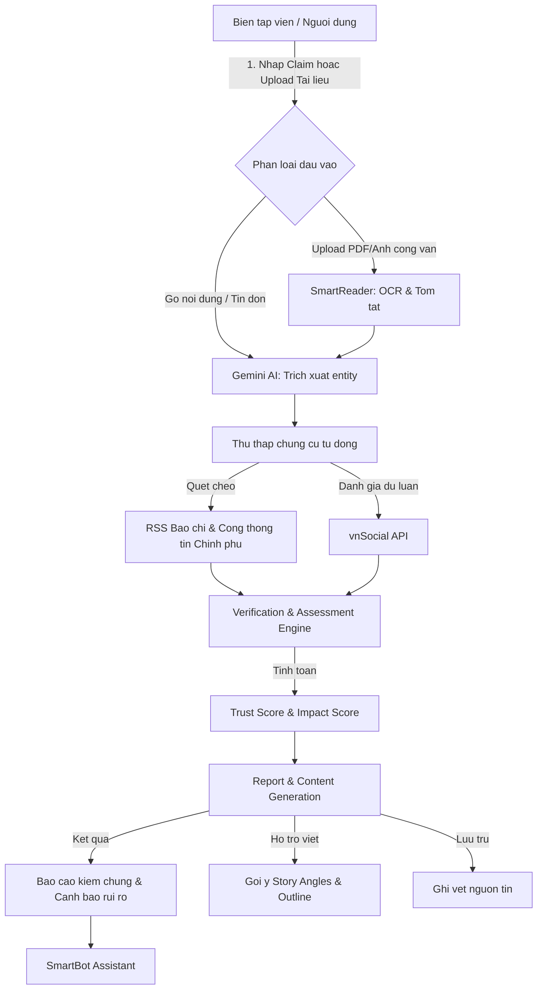

## **1. Executive Summary**

## **Tầm nhìn**

HypeRoom là nền tảng AI Copilot hỗ trợ toàn bộ quy trình phát hiện, xác minh và ra quyết định biên tập dành cho các cơ quan báo chí, truyền thông, truyền hình và các bộ phận xử lý khủng hoảng truyền thông.

Khác với các công cụ AI tạo nội dung thông thường chỉ tập trung vào việc "viết bài tự động", HypeRoom giải quyết bài toán cốt lõi về **quy trình vận hành và kiểm soát rủi ro thông tin** của newsroom trước làn sóng tin tức hỗn loạn trên mạng xã hội.

## **Định vị:**

AI Copilot cho quy trình xác minh (Verification), đánh giá tác động (Impact & Risk Assessment) và hỗ trợ quyết định biên tập (Editorial Intelligence).

## **Mục tiêu:**

- Giảm thời gian xác minh tin tức và tài liệu từ 30 phút xuống còn dưới 3 phút.
- Giảm thiểu tối đa rủi ro xuất bản thông tin sai lệch hoặc vi phạm chính sách pháp lý.
- Tự động đánh giá mức độ lan truyền và phản ứng của dư luận xã hội đối với sự kiện.
- Chuẩn hóa quy trình tác nghiệp số thông qua cơ chế lưu vết (Audit Trail).

---

## **2. Bối Cảnh Thị Trường & Pain Points**

Trong kỷ nguyên mạng xã hội (Facebook, TikTok, Threads, YouTube KOL...), tin tức lan truyền với tốc độ chóng mặt. Các tòa soạn đối mặt với 4 nỗi đau lớn:

1. **Quá tải thông tin & Áp lực thời gian**: Vừa phải đăng tin nhanh để cạnh tranh tương tác, vừa phải kiểm chứng độ xác thực của nguồn tin.
2. **Xác minh thủ công tốn thời gian**: Quy trình tìm văn bản gốc, đối chiếu chéo giữa các nguồn báo chí chính thống và mạng xã hội mất từ 20–40 phút cho mỗi tin.
3. **Rủi ro pháp lý và chính sách**: Không có hệ thống cảnh báo trước các rủi ro liên quan đến chính trị, pháp luật hoặc các chủ đề nhạy cảm trước khi xuất bản.
4. **Thiếu dấu vết phê duyệt (Audit Trail)**: Khi xảy ra sai sót thông tin, rất khó truy xuất nguồn gốc chứng cứ nào đã được sử dụng và ai là người chịu trách nhiệm phê duyệt.

---

## **3. Khách Hàng Mục Tiêu**

- **Báo điện tử & Đài truyền hình** (VnExpress, Dân Trí, VTV, tòa soạn địa phương): Cần công cụ xác minh nhanh công văn/tài liệu và lập đề cương bài viết an toàn.
- **Agency truyền thông & Doanh nghiệp lớn**: Theo dõi khủng hoảng truyền thông liên quan đến thương hiệu.
- **Cơ quan quản lý nhà nước**: Phát hiện sớm tin giả (Fake News) và đánh giá mức độ ảnh hưởng của tin đồn tới dư luận.

---

## **4. Giá Trị Cốt Lõi (Trước & Sau khi có HypeRoom)**

| Nghiệp vụ | Quy trình truyền thống | Với HypeRoom AI Copilot |
| :--- | :--- | :--- |
| **Xác minh tài liệu/công văn** | Gõ tìm thủ công trên Google, gọi điện xác nhận (15-30 phút) | Upload ảnh/PDF $\rightarrow$ SmartReader OCR $\rightarrow$ Đối chiếu chéo nguồn tin cậy tự động (2 phút) |
| **Đánh giá phản ứng dư luận** | Đọc bình luận, thống kê thủ công trên mạng xã hội (20 phút) | vnSocial API tự động phân tích Sắc thái (Sentiment) & Độ lan truyền (10 giây) |
| **Phân tích rủi ro & Định hướng** | Biên tập viên tự cân nhắc dựa trên kinh nghiệm cá nhân (15 phút) | AI sinh Báo cáo rủi ro pháp lý/chính trị & Gợi ý Story Angle an toàn (30 giây) |
| **Lập đề cương & Ghi vết** | Soạn thảo thô, duyệt qua chat/email (15 phút) | AI sinh Outline bài viết + Lưu vết toàn bộ chứng cứ vào Audit Trail (1 phút) |

---

## **5. Luồng Nghiệp Vụ Tối Ưu cho MVP (User-Driven Workflow)**

Để đảm bảo tính khả thi cao nhất cho sản phẩm MVP và tập trung giải quyết đúng pain point một cách chính xác, hệ thống tập trung vào luồng **Người dùng chủ động nhập liệu (Active Input)** thay vì cào quét tự động ngẫu nhiên:

### **Chi tiết các bước xử lý:**

* **Bước 1: Tiếp nhận đầu vào (Input Gateway)**
  * Người dùng có hai cách nhập liệu:
    * Nhập một tuyên bố/tin đồn cần kiểm chứng (Ví dụ: *"Giá xăng sẽ tăng lên 30.000đ vào ngày mai"*).
    * Tải lên một tài liệu (Ảnh chụp công văn, file PDF thông báo, bản thảo).
* **Bước 2: Số hóa tài liệu với SmartReader**
  * Đối với tệp tin/hình ảnh tải lên, hệ thống sử dụng **SmartReader API** để thực hiện OCR cực nhanh, trích xuất toàn bộ nội dung văn bản hành chính sang dạng số và tóm tắt các ý chính để đưa vào pipeline kiểm chứng.
* **Bước 3: Thu thập chứng cứ đa nguồn**
  * **Xác thực thông tin chính thống**: Hệ thống tự động tìm kiếm và đối chiếu với dữ liệu từ các trang báo lớn qua RSS Feed và các Cổng thông tin Chính phủ (`chinhphu.vn`, bộ ngành liên quan) để kiểm tra xem đã có thông tin xác nhận hoặc bác bỏ chưa.
  * **Đánh giá mức độ lan truyền qua vnSocial**: Sử dụng **vnSocial API** để truy vấn trực tiếp từ khóa liên quan đến tin đồn đó nhằm đo lường: lượng tương tác (mention count), xu hướng (trending), và sắc thái dư luận (tích cực/tiêu cực/tranh cãi).
* **Bước 4: Đánh giá định lượng (Trust & Impact Engine)**
  * **Trust Engine (Độ tin cậy)**: Tính toán dựa trên mức độ trùng khớp giữa các nguồn báo chí chính thống và tài liệu được OCR (từ 0 - 100 điểm).
  * **Impact Engine (Mức độ tác động)**: Tính toán từ dữ liệu tương tác của vnSocial và phân loại lĩnh vực ảnh hưởng (Kinh tế, Xã hội, Chính trị).
* **Bước 5: Trợ lý Biên tập & Cảnh báo rủi ro (Editorial Intelligence)**
  * Hệ thống sử dụng Gemini AI sinh ra:
    * **Verification & Risk Report**: Báo cáo chi tiết độ xác thực kèm cảnh báo nếu chủ đề vi phạm các chính sách pháp luật hoặc có nguy cơ khủng hoảng truyền thông.
    * **Story Angles & Outline**: Gợi ý các góc tiếp cận thông tin khách quan, giảm thiểu rủi ro kèm đề cương chi tiết cho bài viết mới.
* **Bước 6: Ghi vết hệ thống (Audit Trail)**
  * Toàn bộ lịch sử xác minh bao gồm nguồn tài liệu tải lên, kết quả OCR, chứng cứ đối chiếu và quyết định duyệt/loại của biên tập viên sẽ được lưu trữ cố định để phục vụ mục đích kiểm toán thông tin sau này.

---

## **6. Tận Dụng Hệ Sinh Thái API VNPT**

Để tối đa hóa điểm số công nghệ và tận dụng sức mạnh có sẵn, HypeRoom tích hợp sâu các API cốt lõi sau:

1. **SmartReader**: Số hóa nhanh công văn, hình ảnh tài liệu, thông cáo báo chí do người dùng upload hoặc quét từ các trang chính phủ để đối chiếu thông tin dạng bảng biểu/văn bản hành chính.
2. **vnSocial**: Công cụ lắng nghe mạng xã hội, cung cấp dữ liệu tức thì về sắc thái (Sentiment Analysis) và lượng tương tác (Virality Score) của chủ đề đang được kiểm chứng.
3. **SmartVoice**: Cho phép biên tập viên chuyển đổi các file ghi âm phỏng vấn hoặc video họp báo thành văn bản (Speech-to-Text), sau đó tự động tóm tắt nội dung để đưa vào hệ thống đối chiếu chứng cứ.
4. **SmartBot**: Đóng vai trò là trợ lý ảo tương tác trực tiếp trên giao diện Dashboard. Người dùng có thể chat trực tiếp với SmartBot để hỏi đáp sâu về dữ liệu chứng cứ, yêu cầu giải thích điểm số hoặc điều chỉnh góc viết của Outline.
5. **SmartUX**: Theo dõi hành vi sử dụng của biên tập viên, tối ưu hóa các điểm tương tác trên Dashboard nhằm cải thiện hiệu suất biên tập tin tức.

---

## **7. Kịch Bản Demo MVP Khả Thi**

Để trình bày thuyết phục trước hội đồng giám khảo, sản phẩm MVP sẽ chuẩn bị 2 kịch bản chính:
* **Kịch bản 1: Xác minh công văn giả mạo bằng SmartReader**
  * Biên tập viên upload ảnh chụp một "công văn khẩn" của bộ ngành về việc điều chỉnh lịch thi hoặc chính sách thuế.
  * SmartReader trích xuất text $\rightarrow$ Hệ thống quét nguồn chính phủ $\rightarrow$ Phát hiện không có văn bản trùng khớp $\rightarrow$ Gán Trust Score thấp $\rightarrow$ Cảnh báo rủi ro cao.
* **Kịch bản 2: Đánh giá một tin đồn đang lan truyền bằng vnSocial**
  * Biên tập viên nhập một tin đồn tài chính đang xôn xao trên mạng.
  * vnSocial API trả về lượng mention đang tăng vọt và sentiment tiêu cực $\rightarrow$ Hệ thống đánh giá Impact Score cực cao $\rightarrow$ Gợi ý biên tập viên viết bài định hướng dư luận với Story Angles an toàn, tránh gây hoang mang dư luận.
