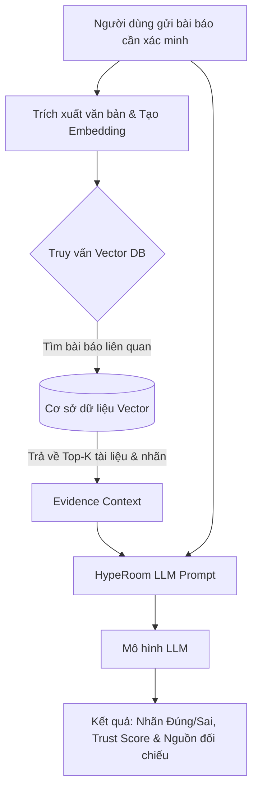

# Kiến Trúc RAG Xác Thực Tin Tức Cho MVP (HypeRoom AI Copilot)

Bản hướng dẫn này mô tả quy trình xây dựng hệ thống **RAG (Retrieval-Augmented Generation)** để kiểm chứng nguồn tin tức phục vụ sản phẩm MVP của dự án.

---

## 1. Luồng Hoạt Động Của Hệ Thống (RAG Workflow)



---

## 2. Lựa Chọn Công Nghệ Cho MVP

### A. Vector Database (Cơ sở dữ liệu Vector)
Đối với MVP, sự đơn giản, dễ cài đặt và miễn phí là ưu tiên hàng đầu:
*   **ChromaDB (Khuyên dùng cho MVP):** Cực kỳ gọn nhẹ, có thể chạy in-memory hoặc local file (không cần server phức tạp), hỗ trợ tốt cho Python/JS.
*   **Qdrant / Pinecone:** Phù hợp nếu bạn muốn chạy cloud service có sẵn API (mức độ scale tốt hơn khi lên Production).
*   **pgvector (PostgreSQL):** Nếu dự án của bạn đã sử dụng PostgreSQL, việc bật extension `pgvector` là phương án tối ưu để quản lý cả dữ liệu quan hệ và vector chung một chỗ.

### B. Thuật Toán Tìm Kiếm Vector Gần Nhất (Nearest Vector Search)
Các Vector DB sử dụng các metric sau để tìm kiếm khoảng cách giữa các vector biểu diễn ngữ nghĩa bài viết:
1.  **Cosine Similarity (Độ tương đồng Cosine - Khuyên dùng):** 
    *   *Công thức:* Đo góc giữa 2 vector, bất kể độ dài văn bản ngắn hay dài.
    *   *Lý do chọn:* Rất hiệu quả cho việc đối chiếu ngữ nghĩa câu chữ trong tin tức (nơi độ dài bài báo có thể khác nhau nhưng ý nghĩa giống nhau).
2.  **L2 Distance (Euclidean Distance):**
    *   Đo khoảng cách thẳng giữa 2 điểm. Thường nhạy cảm với độ dài văn bản (văn bản dài hơn sẽ tạo ra vector xa hơn).
3.  **Dot Product (Tích vô hướng):**
    *   Nhanh nhất nhưng yêu cầu các vector embedding phải được chuẩn hóa (normalized) trước.

---

## 3. Các Bước Xây Dựng RAG Cho MVP (Step-by-Step)

### Bước 1: Xây dựng Cơ sở Tri thức Nguồn (Knowledge Base Setup)
Thu thập các nguồn tin tức uy tín (Chính phủ, Báo chí chính thống VN) và lưu vào cơ sở dữ liệu:
1.  **Thu thập dữ liệu:** Lưu trữ nội dung bài báo, tiêu đề, URL nguồn, thời gian xuất bản và trạng thái xác minh (Ví dụ: `Nguồn chính thống - Tin Cậy`).
2.  **Chunking (Cắt nhỏ văn bản):** Cắt các bài báo dài thành các đoạn nhỏ khoảng 200 - 500 từ (đảm bảo mỗi đoạn giữ nguyên ngữ cảnh cụ thể).
3.  **Embedding:** Sử dụng các mô hình Embedding để chuyển đổi các đoạn văn bản thành Vector (ví dụ: `text-embedding-3-small` của OpenAI, các mô hình embedding tiếng Việt như `vietnamese-bi-encoder`, hoặc Cohere Embedding).
4.  **Insert into Vector DB:** Lưu trữ các vector này vào Vector DB kèm theo Metadata (URL, tiêu đề, ngày tháng).

### Bước 2: Xây dựng Module Truy xuất (Retrieval Module)
Khi người dùng gửi một đoạn tin tức cần kiểm chứng:
1.  **Tạo Query Embedding:** Chuyển văn bản cần xác minh của người dùng thành vector bằng cùng một mô hình embedding đã dùng ở Bước 1.
2.  **Similarity Search:** Thực hiện truy vấn trên Vector DB bằng thuật toán **Cosine Similarity** để lấy ra **Top 3 - 5** đoạn văn bản có độ tương đồng cao nhất.
3.  **Lọc nguồn (Source Metadata Verification):** Trích xuất metadata của các nguồn này để biết xem thông tin đối chiếu đến từ đâu (Báo Nhân Dân, VnExpress, hay một trang blog lạ).

### Bước 3: Thiết lập Prompt & LLM Generation (Xác minh & Phán quyết)
Đưa các tài liệu đã truy xuất được vào Prompt để LLM xử lý. 

**Mẫu Prompt cho LLM:**
```text
Bạn là HypeRoom AI Copilot - chuyên gia xác thực tin tức tại Việt Nam.
Dưới đây là tin tức người dùng yêu cầu xác minh:
---
[TIN TỨC CỦA NGƯỜI DÙNG]
---

Dưới đây là các dẫn chứng (Evidences) chính thống được truy xuất từ cơ sở dữ liệu đáng tin cậy:
---
1. Nguồn: [Tên báo / URL] - Nội dung: [Đoạn trích dẫn 1]
2. Nguồn: [Tên báo / URL] - Nội dung: [Đoạn trích dẫn 2]
---

YÊU CẦU:
1. So sánh tin tức của người dùng với các dẫn chứng chính thống.
2. Đưa ra phán quyết (Verdict): Đúng hoàn toàn, Sai lệch một phần, hoặc Tin giả.
3. Đánh giá độ tin cậy (Trust Score từ 0 đến 100) theo trọng số nguồn: Báo chính thống = 0.8, Cổng thông tin Chính phủ = 1.0.
4. Trích xuất nguồn đối chiếu cụ thể và viết một bài giải thích ngắn gọn, khách quan.
```

---

## 4. Gợi Ý Triển Khai Nhanh Bằng Python (Fast API + ChromaDB)

```python
import chromadb
from openai import OpenAI

# 1. Khởi tạo ChromaDB client & LLM
chroma_client = chromadb.PersistentClient(path="./chroma_db")
collection = chroma_client.get_or_create_collection(name="verified_news")
openai_client = OpenAI(api_key="YOUR_API_KEY")

def verify_news(user_news_text):
    # 2. Truy xuất tài liệu tương đương dùng Cosine Similarity (mặc định trong Chroma)
    results = collection.query(
        query_texts=[user_news_text],
        n_results=3
    )
    
    evidences = results['documents'][0]
    metadata = results['metadatas'][0]
    
    # 3. Gom tài liệu làm Context
    context = "\n".join([f"Nguồn: {meta['source']} - {doc}" for doc, meta in zip(evidences, metadata)])
    
    # 4. Gọi LLM để đưa ra kết luận
    prompt = f"Tin tức cần kiểm chứng:\n{user_news_text}\n\nDẫn chứng kiểm chứng:\n{context}\n\nHãy phân tích và trả về định dạng JSON gồm trust_score, verdict, reason."
    
    response = openai_client.chat.completions.create(
        model="gpt-4o-mini",
        messages=[{"role": "user", "content": prompt}]
    )
    
    return response.choices[0].message.content
```
