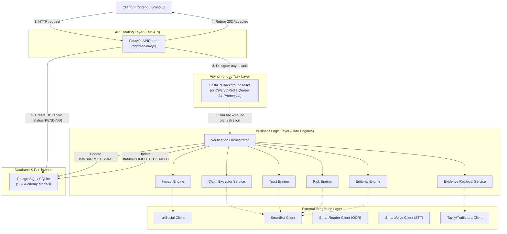

# HypeRoom - Backend Architecture Specification

Tài liệu này đặc tả kiến trúc backend của hệ thống **HypeRoom** sử dụng **FastAPI**, bám sát định hướng thiết kế trong [SystemArchitecture.md](file:///D:/HackAIthon%202026/VietnameseHackAIthon2026-SocialMedia/docs/architectures/SystemArchitecture.md) và các yêu cầu kỹ thuật từ bộ API Bruno trong `docs/bruno/HypeRoom`.

---

## 1. Thiết Kế Kiến Trúc: Asynchronous Modular Monolith

HypeRoom áp dụng kiến trúc **Asynchronous Modular Monolith** (Đơn khối dạng mô-đun kết hợp xử lý bất đồng bộ). Đây là mô hình tối ưu nhất cho giai đoạn MVP và khả năng mở rộng (Scale) nhờ việc phân tách rõ ràng luồng xử lý đồng bộ nhanh (Hot Path) và bất đồng bộ nặng (Cold Path).

### 1.1 Sơ đồ Kiến trúc phân lớp & Luồng xử lý nền



### 1.2 Phân tách luồng xử lý (Hot & Cold Paths)

*   **Hot Path (Đồng bộ - Phản hồi nhanh):** Các API truy xuất như đọc bảng tin xu hướng (`GET /trending`), lịch sử kiểm chứng (`GET /verifications`), hay danh sách lịch sử phản hồi (`GET /feedbacks/history`).
*   **Cold Path (Bất đồng bộ - Tác vụ nặng):** Các API tiếp nhận yêu cầu phân tích mới (`POST /verifications`). Hệ thống sẽ không xử lý trực tiếp trên luồng HTTP để tránh timeout và nghẽn hệ thống. Thay vào đó, API Router trả về mã `202 Accepted` ngay lập tức kèm theo ID tác vụ để Client có thể thực hiện cơ chế Polling hoặc lắng nghe qua WebSocket. Tác vụ sẽ được đưa vào hàng đợi chạy nền.


---

## 2. Cấu Trúc Thư Mục Chi Tiết

Backend được tổ chức trong thư mục `app/server/` như sau:

```text
app/server/
├── main.py                  # Entrypoint khởi tạo FastAPI app, middlewares & lifespan
├── requirements.txt         # Khai báo thư viện phụ thuộc (fastapi, uvicorn, sqlalchemy, etc.)
├── .env.example             # Cấu hình biến môi trường mẫu
│
├── config.py                # Đọc cấu hình từ biến môi trường (Pydantic Settings)
├── database.py              # Cấu hình kết nối DB (SQLAlchemy engine & Session local)
│
├── api/                     # Lớp API Routing (Quản lý Endpoints)
│   ├── __init__.py
│   ├── deps.py              # Chứa các dependencies dùng chung (get_db, authentication, v.v.)
│   └── v1/
│       ├── __init__.py
│       ├── trending.py      # GET /api/v1/trending (Tích hợp vnSocial trending)
│       ├── verifications.py # API quản lý kiểm chứng (Create, List, Detail, Events)
│       ├── feedbacks.py     # API tiếp nhận phản hồi từ BTV (Human-in-the-Loop)
│       └── metrics.py       # API tiếp nhận metric từ phía Client (SmartUX)
│
├── models/                  # Lớp Database Models (SQLAlchemy Declarative Models)
│   ├── __init__.py
│   ├── verification.py      # Lưu thông tin kiểm chứng (claims, evidences, risk reports)
│   └── feedback.py          # Lưu sự kiện phản hồi và lịch sử chỉnh sửa (audit log)
│
├── schemas/                 # Lớp Pydantic Schemas (Validation dữ liệu vào/ra)
│   ├── __init__.py
│   ├── verification.py      # Schemas cho Verification (Create, Response, Detail)
│   ├── feedback.py          # Schemas cho Feedback & Audit log
│   └── trending.py          # Schemas định dạng bài đăng xu hướng từ vnSocial
│
├── services/                # Lớp Core Engines (Business Logic xử lý độc lập)
│   ├── __init__.py
│   ├── claim_extractor.py   # Trích xuất claims/thực thể từ văn bản thô (SmartBot)
│   ├── evidence_retrieval.py# Tìm chứng cứ đa nguồn (Tavily Search + Trafilatura)
│   ├── trust_engine.py      # Đối chiếu chứng cứ, tính toán Trust Score & Rationales
│   ├── impact_engine.py     # Đo lường sức ảnh hưởng dư luận (vnSocial API)
│   ├── risk_engine.py       # Phân tích rủi ro xuất bản (Luật báo chí & An ninh mạng)
│   └── editorial_engine.py  # Tạo Story Angles và dàn bài viết gợi ý (Article Outline)
│
└── vnsocial/                # Module tích hợp hệ sinh thái API VNPT & Client ngoài
    ├── __init__.py
    ├── vnsocial_auth.py     # Quản lý authentication / token VNPT vnSocial
    ├── vnsocial_client.py   # Client kết nối trực tiếp với vnSocial API
    ├── smartbot_client.py   # Client tương tác API SmartBot (LLM Generation)
    ├── smartreader_client.py# Client tích hợp SmartReader (OCR số hóa hình ảnh/PDF)
    └── smartvoice_client.py # Client tích hợp SmartVoice (STT chuyển đổi giọng nói)
```

---

## 3. Ánh Xạ API Endpoints Từ Bruno

Dưới đây là chi tiết ánh xạ các request định nghĩa trong bộ sưu tập Bruno (`docs/bruno/HypeRoom`) vào cấu trúc API endpoints của FastAPI:

| Tập tin Bruno | HTTP Method & Path | API Router Module | Mô tả nghiệp vụ |
| :--- | :--- | :--- | :--- |
| `Get Social Trending.bru` | `GET /api/v1/trending` | `api/v1/trending.py` | Lấy danh sách các chủ đề/từ khóa nóng đang lan truyền từ VNPT vnSocial. |
| `Create Verification.bru` | `POST /api/v1/verifications` | `api/v1/verifications.py` | Tạo yêu cầu kiểm chứng mới từ nội dung văn bản do người dùng nhập hoặc số hóa. |
| `Create Verification From Trending.bru` | `POST /api/v1/verifications/from-trending` | `api/v1/verifications.py` | Tạo yêu cầu kiểm chứng tự động từ một bài đăng hot thuộc danh sách xu hướng vnSocial. |
| `List Verifications.bru` | `GET /api/v1/verifications` | `api/v1/verifications.py` | Liệt kê danh sách các yêu cầu kiểm chứng đã thực hiện. |
| `Get Verification Detail.bru` | `GET /api/v1/verifications/{id}` | `api/v1/verifications.py` | Xem chi tiết kết quả kiểm chứng (bao gồm danh sách claims, evidences, trust/risk scores). |
| `Get Verification Events.bru` | `GET /api/v1/verifications/{id}/events` | `api/v1/verifications.py` | Lấy lịch sử thay đổi/sự kiện liên quan đến yêu cầu kiểm chứng đó. |
| `Create Feedback.bru` | `POST /api/v1/feedbacks` | `api/v1/feedbacks.py` | Cho phép biên tập viên ghi nhận phản hồi, thay đổi điểm số, nội dung nhãn (Human-in-the-Loop). |
| `Get Feedback History.bru` | `GET /api/v1/feedbacks/history` | `api/v1/feedbacks.py` | Truy vấn lịch sử phản hồi và vết audit log của hệ thống. |
| `Send SmartUX Metric.bru` | `POST /api/v1/metrics/smartux` | `api/v1/metrics.py` | Gửi chỉ số tương tác UX từ frontend về lưu trữ/phân tích (tích hợp VNPT SmartUX). |

---

## 4. Nguyên Tắc Thiết Kế Chi Tiết & Quy Định Code

Bám sát quy tắc của dự án tại `AGENTS.md`:
* **Giữ code nhỏ gọn & đơn giản:** Mỗi file service (như `trust_engine.py`, `risk_engine.py`) chỉ tập trung giải quyết đúng một nhiệm vụ nghiệp vụ duy nhất.
* **Dependencies Injection rõ ràng:** Sử dụng cơ chế Dependecy Injection của FastAPI (`Depends`) để inject DB Session (`get_db`) và các API Client, giúp dễ dàng viết Unit Test độc lập.
* **Cách ly API VNPT:** Toàn bộ logic giao tiếp HTTP, xử lý Token/Auth, Retry khi mất kết nối với các dịch vụ của VNPT đều được bọc kín trong thư mục `vnsocial/`. Lớp nghiệp vụ `services/` tuyệt đối không gọi trực tiếp HTTP request tới VNPT.
* **Xử lý bất đồng bộ (Async/Await):** Các endpoint gọi dịch vụ ngoài cần khai báo `async def` và sử dụng thư viện HTTP client bất đồng bộ (`httpx.AsyncClient`) để không chặn luồng chính của hệ thống.
