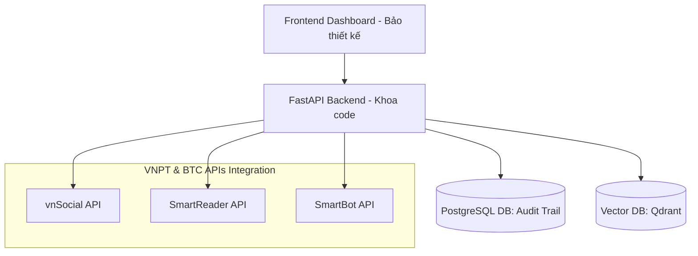

# TÀI LIỆU KỸ THUẬT - HYPEROOM TECHNICAL SPECIFICATION (tech.md)

_Tài liệu phân tích và thiết kế hệ thống kỹ thuật phục vụ Proposal Bảng B - Challenger_
_Chịu trách nhiệm chính bởi: Khoa (Tech Lead)_

---

## I. PHẠM VI MVP ĐỐI VỚI VÒNG HACKAITHON (MVP SCOPE)

Để tối ưu hóa thời gian phát triển 7 ngày và đảm bảo tính khả thi cao nhất, hệ thống được phân định rõ ràng như sau:

- **Nằm trong phạm vi MVP (In-Scope - Hoàn thành ở Vòng 2):**
  - **Luồng dữ liệu tự động:** Tích hợp `vnSocial API` lấy top trending topics và bình luận.
  - **Trích xuất Claim:** Sử dụng LLM (Qwen3.5/Gemma-4) bóc tách các tuyên bố cần kiểm chứng.
  - **RAG Pipeline cốt lõi:**
    - Thu thập chứng cứ từ Web Search.
    - Số hóa tài liệu tham chiếu qua `SmartReader API`.
    - Nhúng dữ liệu (Embedding) bằng model `BGE-m3`.
    - Tái xếp hạng (Rerank) chứng cứ bằng model `Qwen-Rerank`.
    - Xác minh và sinh báo cáo rủi ro (Risk & Verification Report) bằng model `Qwen3.5/Gemma-4` tích hợp qua `SmartBot API`.
  - **Giao diện Dashboard:** Hiển thị danh sách Claim, trạng thái xác minh, nguồn chứng cứ và gợi ý Story Outline cho nhà báo.
  - **Đóng gói hệ thống:** Docker Container hoàn chỉnh, triển khai bằng 1 lệnh duy nhất.
- **Nằm ngoài phạm vi MVP (Out-of-Scope - Dành cho Lộ trình tương lai):**
  - **SmartVoice API:** Tự động ghi âm cuộc gọi phỏng vấn của phóng viên theo thời gian thực (đưa vào Roadmap phát triển Q3).
  - **Audit Trail trên Blockchain:** Chuyển cơ chế lưu vết bảo mật từ cơ sở dữ liệu quan hệ sang mạng phi tập trung để đảm bảo tính bất biến tuyệt đối.

---

## II. KIẾN TRÚC RAG PIPELINE CHI TIẾT (AI PIPELINE WITH ALLOWED MODELS)

Để đạt điểm tối đa tiêu chí **Tính Khả Thi (25đ)**, HypeRoom áp dụng kiến trúc **Retrieval-Augmented Generation (RAG)** chuẩn hóa với các mô hình được BTC quy định:

```
[Văn bản đầu vào]
       │
       ▼ (Qwen3.5 / Gemma-4)
[Bóc tách Claims]
       │
       ▼ (Search Query Generation)
[Google/Bing Search] ──> [Evidence Documents]
                                │
                                ▼ (VNPT SmartReader OCR)
                         [Clean Text Chunks]
                                │
                                ▼ (BGE-m3 Embedding)
                         [Vector Store (Index)]
                                │
                                ├── (BGE-m3 Vector Retrieval)
                                ▼
                         [Top K Chunks]
                                │
                                ▼ (Qwen-Rerank)
                         [Top N Reranked Chunks]
                                │
                                ▼ (Context Injection)
                         [SmartBot API (Qwen3.5 / Gemma-4)]
                                │
                                ▼
                   [Verification & Risk Report]
```

### Quy trình kỹ thuật các bước:

1.  **Trích xuất Claim (Claim Extraction):**
    - Đầu vào là bài viết hoặc social feed.
    - Sử dụng **Qwen3.5 (9B)** để trích xuất danh sách Claims dưới dạng JSON cấu trúc.
2.  **Thu thập & Số hóa chứng cứ (Evidence Ingestion & OCR):**
    - Tìm kiếm tài liệu liên quan từ báo chí chính thống và văn bản nhà nước.
    - Chuyển các tài liệu này qua **VNPT SmartReader API** để trích xuất văn bản thô, sau đó cắt nhỏ thành các đoạn văn (chunks) có kích thước 512 tokens, overlap 10%.
3.  **Nhúng Vector (Vector Embedding):**
    - Sử dụng mô hình **BGE-m3** để chuyển đổi các chunks thành vector 1024-chiều và lưu vào Vector Database (ví dụ: Qdrant hoặc ChromaDB).
4.  **Truy vấn & Tái xếp hạng (Retrieval & Reranking):**
    - Vector hóa câu hỏi kiểm chứng (Claim) bằng **BGE-m3**.
    - Thực hiện tìm kiếm tương đồng ngữ nghĩa (Cosine Similarity) để lấy ra **Top $K$ ($K=15$)** đoạn chứng cứ có điểm số cao nhất.
    - Gửi Top $K$ đoạn chứng cứ và Claim qua mô hình **Qwen-Rerank** để tính toán lại mức độ liên quan thực tế. Chọn ra **Top $N$ ($N=3$)** đoạn chứng cứ chất lượng nhất để làm Context.
5.  **Sinh báo cáo kiểm chứng (Generation):**
    - Nạp Top $N$ đoạn chứng cứ được xếp hạng tốt nhất vào Prompt Context của **SmartBot API (chạy Qwen3.5 hoặc Gemma-4)**.
    - LLM đối chiếu và đưa ra kết luận: `Supported`, `Contradicted` hoặc `Uncertain` kèm theo các lập luận chặt chẽ và nguồn trích dẫn rõ ràng.

---

## III. THIẾT KẾ HỆ THỐNG & TÍCH HỢP API CỦA BTC (SYSTEM DESIGN)

HypeRoom tích hợp các thành phần hệ thống và API theo mô hình dịch vụ độc lập:



### Vai trò cụ thể của các API trong mã nguồn:

- `vnSocial API`: Kết nối qua giao thức HTTPS để pull dữ liệu trending. Sử dụng endpoint phân tích cảm xúc bình luận của BTC để lọc các chủ đề có độ tranh cãi cao (Controversy Score > 0.7).
- `SmartReader API`: Nhận file tải lên từ Backend, xử lý OCR không đồng bộ (Asynchronous) và trả về văn bản dạng text sạch phục vụ cho Vector DB.
- `SmartBot API`: Đóng vai trò là LLM Orchestrator, nhận prompt được thiết kế sẵn (System Prompt định nghĩa vai trò Biên tập viên Kiểm chứng) để sinh kết quả.

---

## IV. BẢO MẬT & KHẢ NĂNG MỞ RỘNG (SECURITY & SCALABILITY)

Để đáp ứng tiêu chí **Tính khả thi (25đ)** từ góc nhìn chuyên gia, hệ thống giải quyết triệt để các bài toán sau:

### 1. An toàn & Bảo mật thông tin (Security)

- **Bảo mật dữ liệu truyền tải:** Toàn bộ API endpoints kết nối giữa Client, Backend và các API của BTC đều được bắt buộc sử dụng giao thức mã hóa **HTTPS (TLS 1.3)**.
- **Bảo mật dữ liệu lưu trữ:** Mã hóa dữ liệu nhạy cảm trong cơ sở dữ liệu quan hệ PostgreSQL bằng thuật toán AES-256.
- **Tính toàn vẹn của Audit Trail:** Toàn bộ lịch sử duyệt tin và nguồn gốc chứng cứ được lưu trữ dưới dạng bản ghi Read-Only. Hệ thống sử dụng cơ chế hash chuỗi (giống blockchain thô) để phát hiện bất kỳ sự can thiệp trái phép nào vào lịch sử kiểm chứng của tòa soạn.

### 2. Khả năng mở rộng (Scalability)

- **Xử lý không đồng bộ (Asynchronous Processing):** Quá trình tải tài liệu, OCR qua `SmartReader` và Crawl dữ liệu web thường mất nhiều thời gian (30 giây - 2 phút). Hệ thống sử dụng **Celery** kết hợp với **Redis Message Broker** để thực hiện tác vụ chạy ngầm. Người dùng sẽ nhận được thông báo trạng thái qua **WebSockets** khi quá trình kiểm chứng hoàn tất.
- **Cơ chế Caching:** Lưu trữ tạm thời (cache) kết quả kiểm chứng của các Claim tương tự nhau hoặc các trang web chứng cứ đã crawl trong vòng 24 giờ vào Redis để giảm thiểu số lượng request trùng lặp đến API của BTC và các Search Engine, tối ưu hóa chi phí hạ tầng.

---

## V. ĐÓNG GÓI VÀ TRIỂN KHAI (DOCKER DEPLOYMENT)
